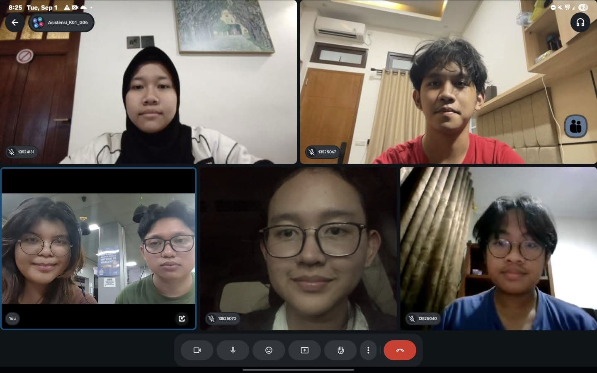

# Form Asistensi

## Tugas Besar IF2150 - Rekayasa Perangkat Lunak

| Informasi | Keterangan |
| --- | --- |
| **Hari** | *\[Selasa\]* |
| **Tanggal** | *\[01/09/2026\]* |
| **Kelas** | *\[K1\]* |
| **Nomor Kelompok** | *\[6\]*  |
| **Nama Kelompok** | *\[MZakyBTW\]*  |
| **Nama Perangkat Lunak** | *\[SisaRasa\]*  |
| **Dokumen** | *\[M1\]*  |

### Anggota Kelompok

| NIM | Nama |
| --- | --- |
| *\[13525067\]* | *\[Fathar Atandra Denaya\]* |
| *\[13525040\]* | *\[Muhammad Zaky Amani\]* |
| *\[13525139\]* | *\[Josephine Bintang N.L\]* |
| *\[13525070\]* | *\[Devina Athalia Putri Kusumah\]* |
| *\[13525004\]* | *\[Nabil Rabbani\]* |

### Catatan

| Catatan |
| --- |
| 1. *\[Melakukan riset terkait hukum/peraturan yang berlaku.\]*  |
| 2. *\[Menentukan sistem gacha yang dapat mengakomodasi informasi alergen.\]*  |
| 3. *\[Membuat diagram proses bisnis sistem.\]*  |

## Dokumentasi

<!--  -->

  

  <i>Gambar 1. Dokumentasi kegiatan asistensi.</i>

