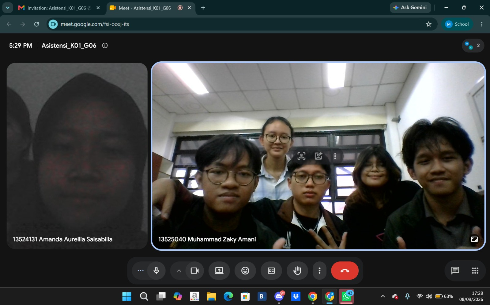

# Form Asistensi

## Tugas Besar IF2150 - Rekayasa Perangkat Lunak

| Informasi | Keterangan |
| --- | --- |
| **Hari** | *\[Selasa\]* |
| **Tanggal** | *\[08/09/2026\]* |
| **Kelas** | *\[K1\]* |
| **Nomor Kelompok** | *\[6\]*  |
| **Nama Kelompok** | *\[MZakyBTW\]*  |
| **Nama Perangkat Lunak** | *\[SisaRasa\]*  |
| **Dokumen** | *\[M2\]*  |

### Anggota Kelompok

| NIM | Nama |
| --- | --- |
| *\[NIM 1\]* | *\[Fathar Atandra Denaya\]* |
| *\[NIM 2\]* | *\[Muhammad Zaky Amani\]* |
| *\[NIM 3\]* | *\[Josephine Bintang N.L\]* |
| *\[NIM 4\]* | *\[Devina Athalia Putri Kusumah\]* |
| *\[NIM 5\]* | *\[Nabil Rabbani\]* |

### Catatan

| Catatan |
| --- |
| 1. *\[Melakukan breakdown terhadap penjelasan pada setiap bagian Bab 2 sesuai hasil asistensi\]*  |
| 2. *\[Melakukan revisi pada bagian Deskripsi Aktivitas sesuai dengan hasil asistensi\]*  |

## Dokumentasi

<!--  -->

  

  <i>Gambar 1. Dokumentasi kegiatan asistensi.</i>

