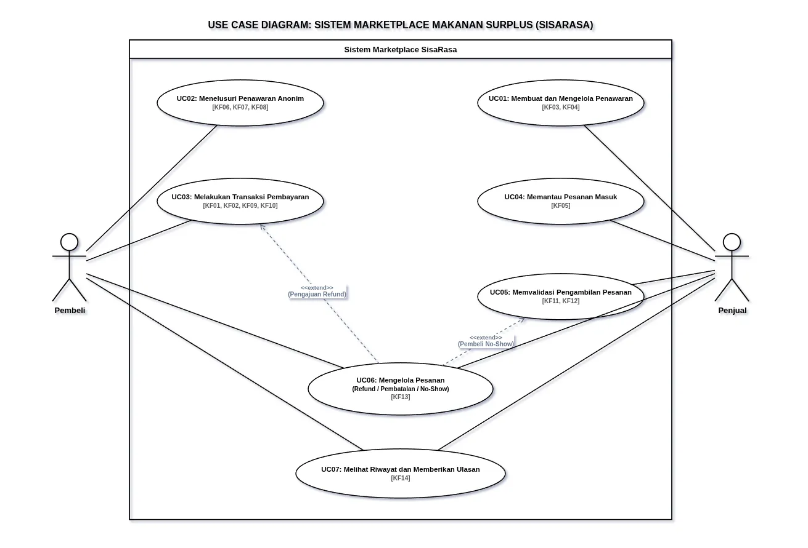
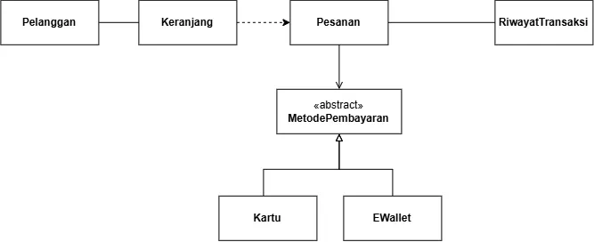

<h1>
IF2150 REKAYASA PERANGKAT LUNAK
 
TUGAS 4
 
CLASS DIAGRAM
</h1>
 

## *Nama Perangkat Lunak*

### Untuk: *[Nama Asisten]*

Dipersiapkan oleh:
| Informasi | Keterangan |
| --- | --- |
| Kelas | *\[K1\]* |
| Kelompok | *\[6\]*  |

| NIM | Nama |
|---|---|
| *[13525067]* | *[Fathar Atandra Denaya]* |
| *[13525040]* | *[Muhammad Zaky Amani]* |
| *[13525139]* | *[Josephine Bintang N.L]* |
| *[13525070]* | *[Devina Athalia Putri Kusumah]* |
| *[13525004]* | *[Nabil Rabbani]* |
---

## Daftar Perubahan

| Revisi | Deskripsi |
| :--- | :--- |
| *A* | *Deskripsikan perubahan yang dilakukan dari dokumen sebelumnya pada dokumen ini. Jika tidak terdapat perubahan, harap kosongkan tabel.* |
| *B* |  |
| *C* |  |
| ... |  |

 
 

# BAB 1: Deskripsi Perangkat Lunak

SisaRasa adalah marketplace penyelamat makanan surplus yang mempertemukan Penjual dan Pembeli melalui sistem "paket kejutan" anonim. Dari segi ekspektasi, Penjual mengharapkan kepraktisan dalam menjual sisa stok secara efisien tanpa merusak citra merek, sedangkan Pembeli menginginkan akses makanan terjangkau yang aman dikonsumsi berkat ketersediaan filter penyaring alergen. Alur operasional sistem ini dimulai saat Penjual membuat penawaran paket (berisi kategori, info alergen, kuota, dan harga), yang kemudian dicari dan dibayar oleh Pembeli melalui metode digital. Setelah transaksi berhasil, barulah lokasi Penjual diungkap agar Pembeli dapat mendatangi lokasi dan mengambil makanannya secara mandiri (pickup-only) menggunakan bukti kode QR. Penerapan solusi ini secara nyata diharapkan mampu meminimalkan kerugian finansial merchant, menyediakan akses pangan yang lebih murah bagi masyarakat, serta menekan angka pemborosan pangan untuk mendukung tercapainya target SDG 2 di Indonesia.

---

# BAB 2: Kebutuhan Fungsional

## 2.1 Kebutuhan Fungsional

Berdasarkan pemetaan kebutuhan yang telah diidentifikasi sebagai elemen yang didukung oleh perangkat lunak (`P/L = Ya`), bagian ini menguraikan spesifikasi Kebutuhan Fungsional (KF) untuk aplikasi SisaRasa. Kebutuhan fungsional ini mendefinisikan kapabilitas, fitur, dan operasional spesifik yang harus dijalankan oleh sistem guna memfasilitasi aktivitas penjual dan pembeli.

Setiap butir KF ditelusuri keterkaitannya secara langsung dengan ID Pemetaan Kebutuhan (`R`) dari Bagian 2.3:

| ID KF | ID Kebutuhan | Penjelasan |
| :--- | :--- | :--- |
| **KF01** | *R26* | Ketika pengguna melakukan *checkout* paket, sistem harus menampilkan pilihan antarmuka metode pembayaran digital (QRIS dan kanal pembayaran terintegrasi). |
| **KF02** | *R27, R29* | Sistem harus mengirimkan permintaan otorisasi transaksi ke API *Payment Gateway* beserta nominal tagihan dan ID Pesanan. Bila melewati batas waktu kedaluwarsa, maka sistem harus membatalkan tagihan. |
| **KF03** | *R01, R03, R04, R05, R06* | Sistem harus menyediakan formulir pembuatan penawaran bagi *merchant* yang mencakup *input* kategori, deklarasi alergen, kuota (> 0), harga normal, harga diskon (50%–70%), konfirmasi kelayakan konsumsi makanan, dan jendela waktu *pickup*. |
| **KF04** | *R07, R09, R10* | Selama belum ada pesanan yang terbayar, sistem harus menampilkan antarmuka manajemen penawaran di mana *merchant* dapat melihat sisa kuota, mengubah rincian, atau menutup penawaran secara manual. |
| **KF05** | *R11, R12* | Sistem harus menampilkan *dashboard* pesanan masuk bagi *merchant* yang memuat status transaksi berhasil, ID pesanan, dan jadwal *pickup*. Ketika ada pesanan baru, sistem harus memberikan notifikasi instan. |
| **KF06** | *R22, R23, R25* | Selama transaksi belum diselesaikan, sistem harus memuat katalog penawaran secara anonim (tanpa foto toko, nama toko, dan alamat presisi) serta menampilkan rincian paket kejutan pada antarmuka pembeli. |
| **KF07** | *R20, R21, R43* | Jika tersedia fitur filter alergen, sistem harus menyembunyikan penawaran sesuai profil pembeli dan menampilkan teks *disclaimer* peringatan risiko kontaminasi silang (anafilaksis) pada antarmuka. |
| **KF08** | *R24* | Sistem harus menghitung jarak perkiraan relatif antara pembeli dengan titik lokasi *merchant* di sisi server tanpa mengekspos koordinat GPS presisi *merchant* ke sisi *client*. |
| **KF09** | *R08, R27* | Ketika sistem menerima *callback webhook* pembayaran berhasil dari *Payment Gateway*, sistem harus memotong sisa kuota penawaran tepat satu unit secara otomatis. |
| **KF10** | *R30, R32, R35* | Ketika pembayaran berhasil, sistem harus membuka identitas *merchant* (nama gerai, foto, dan alamat lengkap penjemputan), menghasilkan token kode *QR pickup* dinamis sekali pakai, dan menampilkannya pada antarmuka pembeli. |
| **KF11** | *R16* | Sistem harus menyediakan akses kamera pada aplikasi pihak *merchant* untuk memindai kode *QR pickup* dari layar ponsel pembeli. |
| **KF12** | *R17, R18* | Ketika *QR pickup* divalidasi berhasil, sistem harus memperbarui status pesanan menjadi "Selesai" dan menjadwalkan pencairan dana (*payout*) ke rekening *merchant* setelah dikurangi biaya layanan platform. |
| **KF13** | *R36, R37, R38* | Sistem harus memfasilitasi antarmuka pengajuan *refund* dan sengketa bagi pembeli, serta fitur pembatalan pesanan bagi *merchant*. Bila batas waktu *pickup* terlampaui (*no-show*), maka sistem harus memproses penanganannya di *backend*. |
| **KF14** | *R39, R40, R41, R42* | Sistem harus menampilkan halaman riwayat transaksi lengkap dengan status pesanan, mencatat audit log, dan mengakumulasi metrik dampak penyelamatan makanan. Ketika transaksi selesai, sistem harus menyediakan kolom *rating* dan ulasan. |

---

# BAB 3: Model Use Case

## 3.1 Identifikasi Aktor

Bagian ini mendeskripsikan seluruh aktor yang berinteraksi langsung dengan sistem SisaRasa. Berikut adalah aktor-aktor yang berperan langsung dalam penggunaan perangkat lunak SisaRasa.

| Aktor | Deskripsi |
| :--- | :--- |
| *Pembeli* | *Pengguna yang menggunakan aplikasi untuk menelusuri penawaran anonim, mengatur filter alergen, melakukan pembayaran, serta mendatangi gerai untuk mengambil pesanan mandiri.* |
| *Penjual* | *Merchant terverifikasi yang membuat dan mengelola penawaran paket surplus, memantau pesanan masuk, serta memindai kode QR pickup sebagai bukti serah terima.* |

## 3.2 Identifikasi Use Case

Bagian ini menguraikan daftar *use case* yang telah diidentifikasi berdasarkan Kebutuhan Fungsional (KF) pada Bab 2. Setiap *use case* memetakan interaksi spesifik antara aktor dan sistem untuk mencapai tujuan tertentu dalam alur operasional SisaRasa.

| ID UC | Nama Use Case | Deskripsi Singkat | Aktor Terlibat | ID KF Terkait |
| :--- | :--- | :--- | :--- | :--- |
| *UC01* | *Membuat dan Mengelola Penawaran* | *Penjual membuat mystery box baru, memantau sisa kuota, serta mengubah atau menutup penawaran yang sedang aktif.* | *Penjual* | *KF03, KF04* |
| *UC02* | *Menelusuri Penawaran Anonim* | *Pembeli mengeksplorasi katalog mystery box terdekat menggunakan filter alergen tanpa melihat identitas spesifik toko.* | *Pembeli* | *KF06, KF07, KF08* |
| *UC03* | *Melakukan Transaksi Pembayaran* | *Pembeli melakukan checkout, memilih metode bayar, dan menyelesaikan pembayaran hingga sistem merilis QR pickup dan identitas toko.* | *Pembeli* | *KF01, KF02, KF09, KF10* |
| *UC04* | *Memantau Pesanan Masuk* | *Penjual melihat daftar pesanan pelanggan yang telah lunas beserta jadwal penjemputan dari dashboard.* | *Penjual* | *KF05* |
| *UC05* | *Memvalidasi Pengambilan Pesanan* | *Penjual memindai kode QR pickup pelanggan untuk membuktikan serah-terima, menyelesaikan pesanan, dan memicu pelepasan dana.* | *Penjual* | *KF11, KF12* |
| *UC06* | *Mengelola Pesanan* | *Pembeli mengajukan pengembalian dana, penjual melakukan pembatalan, atau sistem menangani kasus pembeli tidak hadir* | *Pembeli, Penjual* | *KF13* |
| *UC07* | *Melihat Riwayat dan Memberikan Ulasan* | *Aktor memantau metrik dan log riwayat transaksinya, serta pembeli dapat memberikan rating pada pesanan yang telah selesai.* | *Pembeli, Penjual* | *KF14* |

## 3.3 Use Case Diagram
Diagram berikut memvisualisasikan interaksi fungsional antara aktor dengan sistem SisaRasa secara keseluruhan. Diagram ini mencakup seluruh *use case* utama beserta relasi *include* atau *extend* yang mendefinisikan ketergantungan antarfungsi di dalam sistem.
 

  

  <i>Gambar 1. Use Case Diagram Sistem Marketplace Makanan Surplus (SisaRasa)</i>

 

## 3.4 Skenario Use Case
Skenario use case berikut mendeskripsikan urutan interaksi langkah demi langkah antara aksi aktor dan reaksi perangkat lunak SisaRasa untuk mencapai tujuan dari masing-masing use case yang telah diidentifikasi pada bagian 3.2. Setiap skenario dibagi menjadi dua jenis alur, yaitu skenario normal (alur ideal) dan skenario alternatif (alur ketika terjadi kondisi khusus atau kegagalan).

### 3.4.1 Skenario UC01
**Nama Use Case:** Membuat dan Mengelola Penawaran

**Skenario Normal: Membuat Penawaran Baru**

| No | Aksi Aktor | Reaksi Perangkat Lunak |
| :--- | :--- | :--- |
| 1 | *Penjual membuka menu untuk membuat penawaran baru.* | *Sistem menampilkan formulir yang perlu diinput oleh penjual (kategori makanan, info alergen, jumlah kuota, harga normal, harga diskon, konfirmasi kelayakan, dan batas waktu ambil).* |
| 2 | *Penjual mengisi semua data yang diminta lalu menekan tombol simpan.* | *Sistem mengecek apakah datanya sudah benar (misalnya kuota tidak boleh kosong dan diskon harus 50-70%). Kalau sudah sesuai, sistem langsung memunculkan penawaran tersebut di katalog pembeli.* |

 

**Skenario Alternatif 1: Harga Diskon di Luar Rentang yang Diizinkan**

| No | Aksi Aktor | Reaksi Perangkat Lunak |
| :--- | :--- | :--- |
| 1 | *Penjual mengisi formulir penawaran, tetapi memasukkan harga diskon yang potongannya kurang dari 50% atau lebih dari 70% dari nilai normal, lalu menekan simpan/save.* | *Sistem mendeteksi harga diskon tidak memenuhi rentang 50–70% (R04), menolak penyimpanan/saving, dan menampilkan pesan error yang meminta penjual menyesuaikan harga sebelum penawaran bisa diterbitkan.* |

**Skenario Alternatif 2: Mengubah Penawaran yang Sudah Memiliki Pesanan Terbayar**

| No | Aksi Aktor | Reaksi Perangkat Lunak |
| :--- | :--- | :--- |
| 1 | *Penjual mencoba mengubah rincian (harga/kuota) pada penawaran yang paketnya sudah dibayar pembeli.* | *Sistem mengunci rincian penawaran yang sudah terjual (R10) dan menampilkan pesan bahwa detail tidak dapat diubah lagi.* |
| 2 | *Karena stok mendadak rusak/tidak tersedia, penjual memilih opsi "Batalkan Pesanan" pada pesanan yang sudah dibayar tersebut.* | *Sistem membatalkan pesanan pembeli tersebut dan otomatis memicu proses refund penuh ke pembeli (terhubung ke UC06).* |

---

### 3.4.2 Skenario UC02
**Nama Use Case:** Menelusuri Penawaran Anonim

**Skenario Normal: Mencari Paket dengan Filter Alergen**

| No | Aksi Aktor | Reaksi Perangkat Lunak |
| :--- | :--- | :--- |
| 1 | *Pembeli membuka halaman utama untuk mencari paket makanan.* | *Sistem memuat menu kategori makanan dari berbagai toko terdekat berdasarkan lokasi pembeli, tanpa membocorkan nama atau lokasi pasti toko.* |
| 2 | *Pembeli menyalakan filter alergen tertentu (misalnya alergi kacang).* | *Sistem menyembunyikan paket yang mengandung alergen tersebut.* |
| 3 | *Pembeli mengklik salah satu penawaran paket.* | *Sistem menampilkan detail paket seperti kategori, harga setelah diskon, sisa kuota, dan jam pengambilannya.* |

 

**Skenario Alternatif 1: Tidak Ada Penawaran yang Cocok dengan Filter**

| No | Aksi Aktor | Reaksi Perangkat Lunak |
| :--- | :--- | :--- |
| 1 | *Pembeli mengaktifkan filter alergen tertentu.* | *Sistem menyaring seluruh katalog (R21) dan mendapati tidak ada paket yang tersisa setelah difilter.* |
| 2 | *Pembeli melihat halaman katalog.* | *Sistem menampilkan pesan "Tidak ada penawaran yang sesuai saat ini" beserta disclaimer bahwa filter alergen tidak menjamin 100% bebas kontaminasi silang (R43), dan menyarankan pembeli mencoba lagi nanti atau menonaktifkan sebagian filter.* |

**Skenario Alternatif 2: Pembeli Tidak Mengizinkan Akses Lokasi**

| No | Aksi Aktor | Reaksi Perangkat Lunak |
| :--- | :--- | :--- |
| 1 | *Pembeli menolak izin akses lokasi saat membuka aplikasi.* | *Sistem tidak dapat menghitung jarak perkiraan (R24) sehingga menampilkan katalog tanpa pengurutan berdasarkan jarak, dan memberi tahu pembeli bahwa mengaktifkan lokasi akan menampilkan paket terdekat terlebih dahulu.* |

---

### 3.4.3 Skenario UC03
**Nama Use Case:** Melakukan Transaksi Pembayaran

**Skenario Normal: Checkout dan Pembayaran Berhasil**

| No | Aksi Aktor | Reaksi Perangkat Lunak |
| :--- | :--- | :--- |
| 1 | *Pembeli menekan tombol *checkout* pada paket yang mau dibeli.* | *Sistem menampilkan rincian pesanan dan pilihan metode pembayaran digital, seperti QRIS atau e-wallet*. |
| 2 | *Pembeli memilih metode bayar dan menyetujui transaksi.* | *Sistem meneruskan proses ini ke Payment Gateway dan membooking 1 kuota paket untuk pembeli tersebut.* |
| 3 | *Pembeli selesai membayar di aplikasi pembayaran.* | *Sistem menerima konfirmasi pembayaran sukses, lalu memotong kuota paket secara permanen. Setelah itu, sistem memunculkan nama toko, alamat lengkapnya, dan kode QR untuk syarat pengambilan.* |

 

**Skenario Alternatif 1: Pembayaran Gagal atau Timeout**

| No | Aksi Aktor | Reaksi Perangkat Lunak |
| :--- | :--- | :--- |
| 1 | *Pembeli sudah memilih metode bayar, tetapi tidak menyelesaikan pembayaran hingga batas waktu tagihan berakhir.* | *Sistem menerima status timeout/gagal dari Payment Gateway, membatalkan tagihan, dan melepas kembali kuota paket yang ditahan (R29) agar tersedia untuk pembeli lain.* |
| 2 | *Pembeli kembali ke halaman penawaran.* | *Sistem menampilkan pesan bahwa transaksi dibatalkan dan mempersilakan pembeli mengulang checkout jika kuota masih tersedia.* |

**Skenario Alternatif 2: Kuota Habis Saat Proses Checkout**

| No | Aksi Aktor | Reaksi Perangkat Lunak |
| :--- | :--- | :--- |
| 1 | *Pembeli menekan tombol checkout, tetapi paket terakhir baru saja dibeli pembeli lain sepersekian detik sebelumnya.* | *Sistem mendeteksi kuota sudah 0 sebelum tagihan berhasil dibuat, membatalkan proses checkout, dan menampilkan pesan "Paket sudah habis terjual" tanpa membuat tagihan pembayaran.* |

---

### 3.4.4 Skenario UC04
**Nama Use Case:** Memantau Pesanan Masuk

**Skenario Normal: Menerima Pesanan Baru**

| No | Aksi Aktor | Reaksi Perangkat Lunak |
| :--- | :--- | :--- |
| 1 | *Pembeli yang baru saja berhasil melakukan pembayaran* | *Sistem mengirimkan notifikasi ke HP penjual.* |
| 2 | *Penjual membuka notifikasi tersebut atau masuk ke halaman pesanan.* | *Sistem menampilkan daftar pesanan yang sudah lunas, lengkap dengan ID pesanan dan jadwal kapan pembeli akan datang.* |

 

**Skenario Alternatif 1: Belum Ada Pesanan Masuk**

| No | Aksi Aktor | Reaksi Perangkat Lunak |
| :--- | :--- | :--- |
| 1 | *Penjual membuka halaman dashboard pesanan pada penawaran yang baru saja dipasang dan belum ada pembeli.* | *Sistem menampilkan daftar pesanan dalam keadaan kosong beserta keterangan bahwa notifikasi akan muncul otomatis begitu ada pembayaran masuk.* |

---

### 3.4.5 Skenario UC05
**Nama Use Case:** Memvalidasi Pengambilan Pesanan

**Skenario Normal: Pemindaian Bukti Pengambilan**

| No | Aksi Aktor | Reaksi Perangkat Lunak |
| :--- | :--- | :--- |
| 1 | *Penjual menekan tombol scan QR saat pembeli datang ke toko.* | *Sistem membuka fitur kamera di aplikasi penjual.* |
| 2 | *Penjual memindai kode QR yang ditunjukkan oleh pembeli dari layar HP-nya.* | *Sistem memastikan kode QR tersebut valid. Setelah cocok, sistem mengubah status pesanan jadi "Selesai" dan memasukkan dana pembayaran ke saldo penjual (setelah dipotong biaya admin aplikasi).* |

 

**Skenario Alternatif 1: Kode QR Tidak Valid atau Sudah Pernah Dipindai**

| No | Aksi Aktor | Reaksi Perangkat Lunak |
| :--- | :--- | :--- |
| 1 | *Penjual memindai kode QR yang ternyata sudah pernah digunakan sebelumnya, sudah expired, atau tidak cocok dengan ID pesanan manapun di toko tersebut.* | *Sistem menolak validasi token (R17), menampilkan pesan "QR tidak valid/sudah digunakan", dan status pesanan tidak berubah menjadi "Selesai" sehingga dana tidak ikut dicairkan.* |

---

### 3.4.6 Skenario UC06
**Nama Use Case:** Mengelola Pesanan

**Skenario Normal: Penjual Membatalkan Pesanan**

| No | Aksi Aktor | Reaksi Perangkat Lunak |
| :--- | :--- | :--- |
| 1 | *Penjual memilih pesanan yang sudah masuk, lalu menekan tombol batal (misalnya karena makanan mendadak rusak/habis).* | *Sistem membatalkan pesanan tersebut dan langsung memproses refund ke pembeli secara otomatis.* |

 

**Skenario Alternatif 1: Pembeli Mengajukan Refund karena Paket Tidak Layak**

| No | Aksi Aktor | Reaksi Perangkat Lunak |
| :--- | :--- | :--- |
| 1 | *Pembeli sudah membayar dan lokasi sudah terbuka, tetapi menemukan paket tidak sesuai kategori/tidak layak konsumsi sebelum QR dipindai, lalu mengajukan refund lewat aplikasi.* | *Sistem menandai pesanan berstatus tertunda dan meminta konfirmasi dari penjual sebelum dana dilepas (R36, R37), karena QR belum sempat dipindai.* |
| 2 | *	Penjual mengonfirmasi bahwa keluhan pembeli benar.* | *Sistem memproses refund penuh ke pembeli dan menutup status tertunda.* |

**Skenario Alternatif 2: Pembeli Tidak Hadir Sampai Jendela Pickup Berakhir**

| No | Aksi Aktor | Reaksi Perangkat Lunak |
| :--- | :--- | :--- |
| 1 | *Pembeli tidak datang ke gerai hingga batas waktu jendela pickup yang tertera pada pesanan berakhir, dan QR pickup tidak pernah dipindai.* | *Sistem otomatis mengubah status pesanan menjadi "Gagal Diambil" begitu jendela pickup terlewati, menonaktifkan QR pickup yang belum terpakai, dan tetap menjadwalkan payout ke penjual tanpa refund ke pembeli (R37, R38) karena penjual sudah menahan paket tersebut untuk pembeli ini.* |

---

### 3.4.7 Skenario UC07
**Nama Use Case:** Melihat Riwayat dan Memberikan Ulasan

**Skenario Normal: Memantau Riwayat dan Memberi Rating**

| No | Aksi Aktor | Reaksi Perangkat Lunak |
| :--- | :--- | :--- |
| 1 | *Pengguna (penjual/pembeli) membuka halaman riwayat transaksi.* | *Sistem menampilkan daftar semua pesanan yang pernah dilakukan.* |
| 2 | *Pembeli memilih salah satu pesanan yang sudah selesai lalu menekan tombol beri ulasan.* | *Sistem memunculkan form untuk mengisi rating dan komentar.* |
| 3 | *Pembeli menulis ulasan dan menyimpannya.* | *Sistem menyimpan ulasan tersebut untuk ditampilkan pada profil penilaian toko penjual.* |

 

**Skenario Alternatif 1: Mencoba Memberi Ulasan pada Pesanan yang Belum Selesai**

| No | Aksi Aktor | Reaksi Perangkat Lunak |
| :--- | :--- | :--- |
| 1 | *Pembeli membuka riwayat transaksi dan mencoba menekan tombol beri ulasan pada pesanan yang statusnya masih "Menunggu Pickup" (QR belum dipindai).* | *Sistem menonaktifkan/menyembunyikan tombol beri ulasan untuk pesanan yang belum berstatus "Selesai" dan menampilkan keterangan bahwa ulasan hanya dapat diberikan setelah serah-terima terkonfirmasi.* |

---

# BAB 4: Diagram Kelas
Bagian ini berisi identifikasi kelas dan pemodelan struktur kelas yang diperlukan untuk merealisasikan use case pada BAB 3. Gunakan skenario use case (3.4) sebagai dasar untuk menentukan kelas, atribut, metode, dan hubungan antarkelas.

## 4.1 Identifikasi Kelas
Identifikasi seluruh kelas yang diperlukan berdasarkan use case dan skenarionya. Satu kelas boleh terkait dengan lebih dari satu use case.

| ID Kelas | Nama Kelas | Deskripsi Kelas | ID Use Case |
| :--- | :--- | :--- | :--- |
| *C01* | *Penjual* | *Menyimpan data akun merchant terverifikasi yang membuat penawaran, memantau pesanan masuk, memindai QR pickup, dan menerima payout.* | *UC01, UC04, UC05, UC06, UC07* |
| *C02* | *Pembeli* | *Menyimpan data akun konsumen yang menelusuri katalog, melakukan pembayaran, mengambil pesanan, dan memberi ulasan.* | *UC02, UC03, UC05, UC06, UC07* |
| *C03* | *Penawaran* | *Menyimpan data satu paket kejutan (kategori, info alergen, kuota, harga normal/diskon, jendela pickup) yang dibuat penjual dan ditampilkan anonim di katalog.* | *UC01, UC02, UC03* |
| *C04* | *Pesanan* | *Menyimpan data satu transaksi pemesanan atas sebuah penawaran, beserta status alurnya (menunggu bayar, menunggu pickup, selesai, gagal diambil/no-show, dibatalkan).* | *UC03, UC04, UC05, UC06, UC07* |
| *C05* | *MetodePembayaran* | *Kelas yang merepresentasikan metode pembayaran digital yang dipilih pembeli saat checkout.* | *UC03* |
| *C06* | *QRIS* | *Merealisasikan pembayaran via QRIS dengan mengirimkan permintaan otorisasi ke Payment Gateway (dummy).* | *UC03* |
| *C07* | *EWallet* | *Merealisasikan pembayaran via e-wallet dengan mengirimkan permintaan otorisasi ke Payment Gateway (dummy).* | *UC03* |
| *C08* | *QRPickup* | *Menyimpan token kode QR dinamis sekali pakai yang menjadi bukti sah pengambilan pesanan sekaligus pemicu payout ke penjual.* | *UC03, UC05* |
| *C09* | *Pengaduan* | *Menyimpan data pengajuan refund/sengketa atas pesanan bermasalah (paket tidak layak, dibatalkan penjual, atau no-show) beserta status penyelesaiannya.* | *UC06* |
| *C10* | *Ulasan* | *Menyimpan rating bintang dan komentar yang diberikan pembeli terhadap pesanan yang telah berstatus "Selesai".* | *UC07* |
| *C11* | *RiwayatTransaksi* | *Mencatat log seluruh transaksi (audit trail) dan mengakumulasi metrik dampak, seperti jumlah paket berhasil diserahkan.* | *UC07* |

Pastikan setiap kelas memiliki tanggung jawab yang jelas dan memang diperlukan untuk merealisasikan fungsi yang dimodelkan. Hindari kelas yang tidak memiliki keterkaitan dengan KF atau use case manapun.

## 4.2 Diagram Kelas per Use Case
Buat diagram kelas untuk setiap use case pada 3.2.

### 4.2.1 Use Case UC01

**Nama Use Case:** _Memesan Produk_

#### Identifikasi Kelas

| ID Kelas | Nama Kelas  | Deskripsi Kelas                                                                                                                                                 |
| :------- | :---------- | :-------------------------------------------------------------------------------------------------------------------------------------------------------------- |
| _C01_    | _Penjual_   | _Menyimpan data akun merchant terverifikasi yang membuat penawaran, memantau pesanan masuk, memindai QR pickup, dan menerima payout._                           |
| _C03_    | _Penawaran_ | _Menyimpan data satu paket kejutan (kategori, info alergen, kuota, harga normal/diskon, jendela pickup) yang dibuat penjual dan ditampilkan anonim di katalog._ |

#### Diagram Kelas

<i>Gambar 2. Diagram Kelas Use Case UC01</i>

 

| ID Kelas | Nama Kelas  | Atribut                                                                                      | Metode/Operasi                                        |
| :------- | :---------- | :------------------------------------------------------------------------------------------- | :---------------------------------------------------- |
| _C01_    | _Penjual_   | _idPenjual, namaGerai, alamat_                                                               | _buatPenawaran(), ubahPenawaran(), tutupPenawaran()_  |
| _C03_    | _Penawaran_ | _idPenawaran, kategori, infoAlergen, kuota, hargaNormal, hargaDiskon, jendelaPickup, status_ | _simpanPenawaran(), perbaruiDetail(), kurangiKuota()_ |

### 4.2.2 Use Case UC02

**Nama Use Case:** _Menelusuri Penawaran Anonim_

#### Identifikasi Kelas

| ID Kelas | Nama Kelas  | Deskripsi Kelas                                                                                                                                                 |
| :------- | :---------- | :-------------------------------------------------------------------------------------------------------------------------------------------------------------- |
| _C02_    | _Pembeli_   | _Menyimpan data akun konsumen yang menelusuri katalog, melakukan pembayaran, mengambil pesanan, dan memberi ulasan._                                            |
| _C03_    | _Penawaran_ | _Menyimpan data satu paket kejutan (kategori, info alergen, kuota, harga normal/diskon, jendela pickup) yang dibuat penjual dan ditampilkan anonim di katalog._ |

#### Diagram Kelas

<i>Gambar 2. Diagram Kelas Use Case UC01</i>

 

| ID Kelas | Nama Kelas  | Atribut                                                                                      | Metode/Operasi                                        |
| :------- | :---------- | :------------------------------------------------------------------------------------------- | :---------------------------------------------------- |
| _C01_    | _Penjual_   | _idPenjual, namaGerai, alamat_                                                               | _buatPenawaran(), ubahPenawaran(), tutupPenawaran()_  |
| _C03_    | _Penawaran_ | _idPenawaran, kategori, infoAlergen, kuota, hargaNormal, hargaDiskon, jendelaPickup, status_ | _simpanPenawaran(), perbaruiDetail(), kurangiKuota()_ |

### 4.2.3 Use Case UC03

**Nama Use Case:** _Melakukan Transaksi Pembayaran_

#### Identifikasi Kelas

| ID Kelas | Nama Kelas         | Deskripsi Kelas                                                                                                      |
| :------- | :----------------- | :------------------------------------------------------------------------------------------------------------------- |
| _C02_    | _Pembeli_          | _Menyimpan data akun konsumen yang menelusuri katalog, melakukan pembayaran, mengambil pesanan, dan memberi ulasan._ |
| _C03_    | _Penawaran_        | _Menyimpan data satu paket kejutan yang dibuat penjual dan ditampilkan anonim di katalog._                           |
| _C04_    | _Pesanan_          | _Menyimpan data satu transaksi pemesanan atas sebuah penawaran, beserta status alurnya._                             |
| _C05_    | _MetodePembayaran_ | _Kelas yang merepresentasikan metode pembayaran digital yang dipilih pembeli saat checkout._                         |
| _C06_    | _QRIS_             | _Merealisasikan pembayaran via QRIS dengan mengirimkan permintaan otorisasi ke Payment Gateway (dummy)._             |
| _C07_    | _EWallet_          | _Merealisasikan pembayaran via e-wallet dengan mengirimkan permintaan otorisasi ke Payment Gateway (dummy)._         |
| _C08_    | _QRPickup_         | _Menyimpan token kode QR dinamis sekali pakai yang menjadi bukti sah pengambilan pesanan._                           |

#### Diagram Kelas

<i>Gambar 2. Diagram Kelas Use Case UC01</i>

 

| ID Kelas | Nama Kelas         | Atribut                                | Metode/Operasi                           |
| :------- | :----------------- | :------------------------------------- | :--------------------------------------- |
| _C02_    | _Pembeli_          | _idPembeli, nama, email_               | _checkoutPesanan(), pilihMetodeBayar()_  |
| _C03_    | _Penawaran_        | _idPenawaran, kuota_                   | _cekKetersediaanKuota(), kurangiKuota()_ |
| _C04_    | _Pesanan_          | _idPesanan, totalHarga, statusPesanan_ | _buatPesanan(), batalkanTagihan()_       |
| _C05_    | _MetodePembayaran_ | _idMetode, jenisBayar_                 | _prosesPembayaran()_                     |
| _C06_    | _QRIS_             | _kodeQRIS_                             | _mintaOtorisasi()_                       |
| _C07_    | _EWallet_          | _idAkun_                               | _mintaOtorisasi()_                       |
| _C08_    | _QRPickup_         | _tokenQR, statusQR_                    | _generateQR()_                           |

### 4.2.4 Use Case UC04

**Nama Use Case:** _Memantau Pesanan Masuk_

#### Identifikasi Kelas

| ID Kelas | Nama Kelas | Deskripsi Kelas                                                                                                                       |
| :------- | :--------- | :------------------------------------------------------------------------------------------------------------------------------------ |
| _C01_    | _Penjual_  | _Menyimpan data akun merchant terverifikasi yang membuat penawaran, memantau pesanan masuk, memindai QR pickup, dan menerima payout._ |
| _C04_    | _Pesanan_  | _Menyimpan data satu transaksi pemesanan atas sebuah penawaran, beserta status alurnya._                                              |

#### Diagram Kelas

<i>Gambar 2. Diagram Kelas Use Case UC01</i>

 

| ID Kelas | Nama Kelas | Atribut                                  | Metode/Operasi                                     |
| :------- | :--------- | :--------------------------------------- | :------------------------------------------------- |
| _C01_    | _Penjual_  | _idPenjual_                              | _checkoutPesanan(), pilihMetodeBayar()_            |
| _C04_    | _Pesanan_  | _idPesanan, statusPesanan, jadwalPickup_ | _tampilkanDetailPesanan(), kirimNotifikasiMasuk()_ |

### 4.2.5 Use Case UC05

**Nama Use Case:** _Memvalidasi Pengambilan Pesanan_

#### Identifikasi Kelas

| ID Kelas | Nama Kelas | Deskripsi Kelas                                                                                                               |
| :------- | :--------- | :---------------------------------------------------------------------------------------------------------------------------- |
| _C01_    | _Penjual_  | _Menyimpan data akun merchant terverifikasi yang memindai QR pickup dan menerima payout._                                     |
| _C02_    | _Pembeli_  | _Menyimpan data akun konsumen yang mengambil pesanan dan menunjukkan QR._                                                     |
| _C04_    | _Pesanan_  | _Menyimpan data satu transaksi pemesanan atas sebuah penawaran, beserta status alurnya._                                      |
| _C08_    | _QRPickup_ | _Menyimpan token kode QR dinamis sekali pakai yang menjadi bukti sah pengambilan pesanan sekaligus pemicu payout ke penjual._ |

#### Diagram Kelas

<i>Gambar 2. Diagram Kelas Use Case UC01</i>

 

| ID Kelas | Nama Kelas | Atribut                    | Metode/Operasi                           |
| :------- | :--------- | :------------------------- | :--------------------------------------- |
| _C01_    | _Penjual_  | _idPenjual_                | _scanQRPickup()_                         |
| _C02_    | _Pembeli_  | _idPembeli_                | _tampilkanQRPickup()_                    |
| _C04_    | _Pesanan_  | _idPesanan, statusPesanan_ | _selesaikanPesanan(), jadwalkanPayout()_ |
| _C08_    | _QRPickup_ | _tokenQR, statusQR_        | _validasiQR(), tandaiTerpakai()_         |

### 4.2.6 Use Case UC06

**Nama Use Case:** _Mengelola Pesanan_

#### Identifikasi Kelas

| ID Kelas | Nama Kelas  | Deskripsi Kelas                                                                                    |
| :------- | :---------- | :------------------------------------------------------------------------------------------------- |
| _C01_    | _Penjual_   | _Menyimpan data akun merchant terverifikasi yang mengelola pembatalan pesanan dan sengketa._       |
| _C02_    | _Pembeli_   | _Menyimpan data akun konsumen yang mengajukan pengembalian dana._                                  |
| _C04_    | _Pesanan_   | _Menyimpan data satu transaksi pemesanan atas sebuah penawaran, beserta status alurnya._           |
| _C09_    | _Pengaduan_ | _Menyimpan data pengajuan refund/sengketa atas pesanan bermasalah beserta status penyelesaiannya._ |

#### Diagram Kelas

<i>Gambar 2. Diagram Kelas Use Case UC01</i>

 

| ID Kelas | Nama Kelas  | Atribut                                   | Metode/Operasi                            |
| :------- | :---------- | :---------------------------------------- | :---------------------------------------- |
| _C01_    | _Penjual_   | _idPenjual_                               | _batalkanPesanan(), konfirmasiSengketa()_ |
| _C04_    | _Pembeli_   | _idPembeli_                               | _ajukanRefund()_                          |
| _C04_    | _Pesanan_   | _idPesanan, statusPesanan_                | _ubahStatusGagal(), ubahStatusBatal()_    |
| _C09_    | _Pengaduan_ | _idPengaduan, alasan, statusPenyelesaian_ | _prosesRefund(), tanganiNoShow()_         |

### 4.2.7 Use Case UC07

**Nama Use Case:** _Melihat Riwayat dan Memberikan Ulasan_

#### Identifikasi Kelas

| ID Kelas | Nama Kelas         | Deskripsi Kelas                                                                                                 |
| :------- | :----------------- | :-------------------------------------------------------------------------------------------------------------- |
| _C01_    | _Penjual_          | _Menyimpan data akun merchant terverifikasi yang memantau riwayat._                                             |
| _C02_    | _Pembeli_          | _Menyimpan data akun konsumen yang memantau riwayat dan memberi ulasan._                                        |
| _C04_    | _Pesanan_          | _Menyimpan data satu transaksi pemesanan atas sebuah penawaran._                                                |
| _C10_    | _Ulasan_           | _Menyimpan rating bintang dan komentar yang diberikan pembeli terhadap pesanan yang telah berstatus "Selesai"._ |
| _C11_    | _RiwayatTransaksi_ | _Mencatat log seluruh transaksi (audit trail) dan mengakumulasi metrik dampak._                                 |

#### Diagram Kelas

<i>Gambar 2. Diagram Kelas Use Case UC01</i>

 

| ID Kelas | Nama Kelas         | Atribut                                 | Metode/Operasi                  |
| :------- | :----------------- | :-------------------------------------- | :------------------------------ |
| _C01_    | _Penjual_          | _idPenjual_                             | _lihatRiwayat(), lihatUlasan()_ |
| _C02_    | _Pembeli_          | _idPembeli_                             | _lihatRiwayat(), buatUlasan()_  |
| _C04_    | _Pesanan_          | _idPesanan, statusPesanan_              | _tampilkanDetailSelesai()_      |
| _C10_    | _Ulasan_           | _idUlasan, rating, komentar_            | _simpanUlasan()_                |
| _C11_    | _RiwayatTransaksi_ | _idRiwayat, logTransaksi, metrikDampak_ | _catatLog(), hitungMetrik()_    |

## 4.3 Diagram Kelas Keseluruhan

Gabungkan seluruh kelas dan hubungan antarkelas dari diagram kelas setiap use case menjadi satu diagram kelas keseluruhan. Pastikan tidak ada kelas yang terduplikasi.

<i>Gambar X. Diagram Kelas Keseluruhan</i>

 

| ID Kelas | Nama Kelas | Atribut | Metode/Operasi |
| :--- | :--- | :--- | :--- |
| *C01* | *Pelanggan* | *idPelanggan, nama, email* | *lihatRiwayatPesanan()* |
| *C02* | *Pesanan* | *idPesanan, total, status* | *hitungTotal(), perbaruiStatus()* |
| *C03* | *Keranjang* | *daftarItem* | *tambahItem(), checkout()* |
| *C04* | *MetodePembayaran* | *-* | *kirimKePaymentGatewayDummy()* |
| *C05* | *Kartu* | *nomorKartu, masaBerlaku* | *kirimKePaymentGatewayDummy()* |
| *C06* | *EWallet* | *saldo, idAkun* | *cekSaldo(), kirimKePaymentGatewayDummy()* |
| *C07* | *RiwayatTransaksi* | *idTransaksi, waktu, status* | *catatTransaksi(), tampilkanNotifikasi()* |
| *...* | *...* | *...* | *...* |

---

# BAB 5: Traceability
Cocokkan setiap kebutuhan fungsional, use case, dengan diagram kelas yang mendukung atau mengimplementasikan kebutuhan tersebut.

| ID Kelas | ID Use Case | ID KF |
| :--- | :--- | :--- |
| *C01* | *UC01, UC05* | *KF01, KF06* |
| *C02* | *UC01, UC03, UC05* | *KF01, KF02, KF05, KF06* |
| *C03* | *UC01, UC02* | *KF01, KF02* |
| *C04* | *UC03, UC04* | *KF03* |
| *C05* | *UC03, UC04* | *KF03* |
| *C06* | *UC03, UC04* | *KF03, KF04* |
| *C07* | *UC03, UC05* | *KF04, KF05* |
| *...* | *...* | *...* |

---

# Referensi

- Diagram UML: [https://www.drawio.com/](https://www.drawio.com/), [https://staruml.io/](https://staruml.io/)
