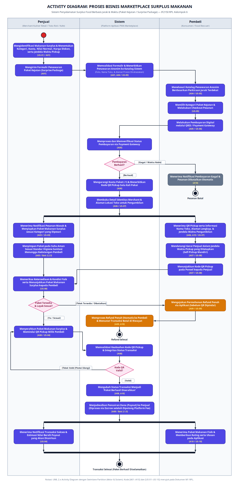
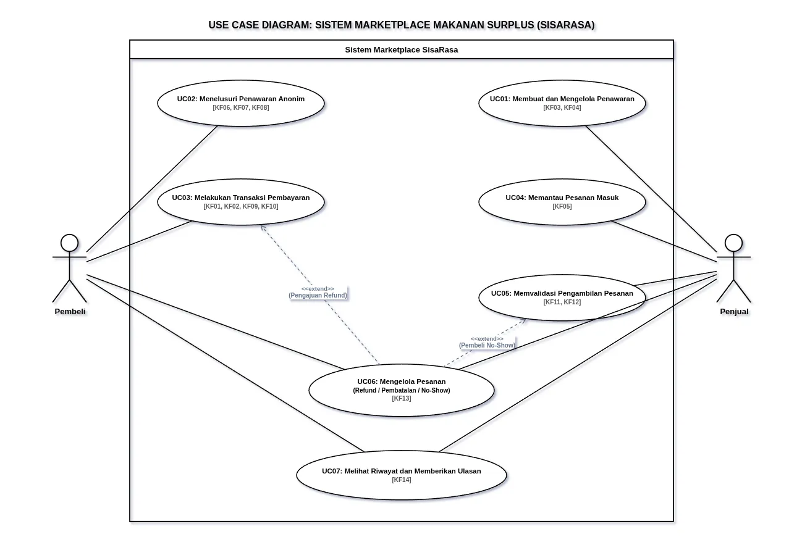

<h1>
IF2150 REKAYASA PERANGKAT LUNAK
 
TUGAS 5
 
SPESIFIKASI KEBUTUHAN PERANGKAT LUNAK (SKPL)
</h1>
 

## *SisaRasa*

### Untuk: *[Amanda Aurellia Salsabilla]*

Dipersiapkan oleh:

| Informasi | Keterangan |
| --- | --- |
| Kelas | *\[K1\]* |
| Kelompok | *\[6\]*  |

| NIM | Nama |
|---|---|
| *[13525067]* | *[Fathar Atandra Denaya]* |
| *[13525040]* | *[Muhammad Zaky Amani]* |
| *[13525139]* | *[Josephine Bintang N.L]* |
| *[13525070]* | *[Devina Athalia Putri Kusumah]* |
| *[13525004]* | *[Nabil Rabbani]* |
---

## Daftar Perubahan

| Revisi | Deskripsi |
| :--- | :--- |
| *A* | Penyesuaian arsitektur klien dari PWA ke aplikasi Android native (Flutter) serta penyusunan spesifikasi lingkungan operasi perangkat lunak (Bab 2.5). |
| *B* |  |
| *C* |  |
| ... |  |

 

# BAB 1: Pendahuluan

## 1.1 Tujuan Penulisan Dokumen
Dokumen Spesifikasi Kebutuhan Perangkat Lunak (SKPL) ini bertujuan untuk merinci secara komprehensif seluruh spesifikasi fungsional, non-fungsional, serta batasan operasional yang dibutuhkan dalam pengembangan aplikasi SisaRasa. Dokumen ini dirancang sebagai acuan teknis utama bagi tim pengembang, perancang sistem, penguji (tester), serta pihak asisten mata kuliah Rekayasa Perangkat Lunak dalam memahami ruang lingkup dan perilaku sistem secara utuh sebelum tahap implementasi kode dilakukan.

## 1.2 Lingkup Masalah
SisaRasa adalah aplikasi *marketplace* penyelamat makanan surplus berbasis Android native (Flutter) yang memfasilitasi transaksi "paket kejutan" anonim antara *merchant* makanan (Penjual) dan konsumen (Pembeli). Solusi ini dirancang untuk mengatasi kerugian finansial *merchant* akibat penumpukan makanan layak makan yang tak terjual, sekaligus menyediakan akses pangan berkualitas dengan harga terjangkau (diskon 50%–70%) bagi masyarakat. Sistem membatasi interaksi secara anonim hingga transaksi lunas, serta mewajibkan mekanisme pengambilan mandiri (*pickup-only*) menggunakan kode QR dinamis untuk menjamin kepraktisan operasional tanpa mengganggu sistem kasir internal toko.

## 1.3 Definisi, Istilah, dan Singkatan
Semua definisi, singkatan, dan akronim yang digunakan dalam dokumen SKPL ini beserta penjelasannya diuraikan pada Tabel 1.3 di bawah ini:

Tabel 1.3. Definisi Istilah dan Singkatan

| Singkatan, Akronim, atau Istilah | Penjelasan |
| :--- | :--- |
| *SisaRasa* | *Nama perangkat lunak berupa aplikasi marketplace penyelamat makanan surplus berbasis web (PWA)* |
| *P/L* | *Singkatan dari Perangkat Lunak, yaitu aplikasi yang memberikan parintah kepada komputer untuk menjalankan tugas tertentu.* |
| *KF* | *Singkatan dari Kebutuhan Fungsional.* |
| *KNF* | *Singkatan dari Kebutuhan Non-Fungsional.* |
| *UC* | *Singkatan dari Use Case.* |
| *EARS* | *Easy Approach to Requirements Syntax, yaitu pola penulisan kebutuhan agar konsisten dan mudah diuji.* |
| *QRIS* | *Quick Response Code Indonesian Standard, yaitu standarisasi pembayaran menggunakan kode QR nasional untuk memproses transaksi digital.* |
| *Payout* | *Proses pencairan dana dari platform kepada penjual setelah pesanan berhasil diserahkan dan divalidasi.* |
| *Pickup-only* | *Mekanisme pemenuhan pesanan di mana pembeli wajib mengambil makanan secara mandiri ke lokasi penjual tanpa menggunakan jasa kurir pengantaran* |

## 1.4 Aturan Penomoran
Dokumen Spesifikasi Kebutuhan Perangkat Lunak (SKPL) ini menggunakan aturan penomoran identitas (ID) yang konsisten dengan dokumen-dokumen perancangan sebelumnya. Penomoran ID digunakan untuk mempermudah pemetaan dan pelacakan antar-elemen kebutuhan, aktor, *use case*, dan kelas.

Tabel 1.4. Aturan Penomoran

| Hal/Bagian | Penomoran | Keterangan |
| :--- | :--- | :--- |
| *Pemetaan Kebutuhan* | *RXX* | Menunjukkan ID kebutuhan dasar hasil analisis masalah. |
| *Kebutuhan Fungsional* | *KFXX* | Menunjukkan ID Kebutuhan Fungsional perangkat lunak. |
| *Kebutuhan Non-Fungsional* | *KNFXX* | Menunjukkan ID Kebutuhan Non-Fungsional (kualitas, keamanan, performa). |
| *Aktor* | *AXX* | Menunjukkan ID aktor pengguna yang berinteraksi dengan sistem. |
| *Use Case* | *UCXX* | Menunjukkan ID fungsi/unit interaksi pada *Use Case Diagram*. |
| *Kelas* | *CXX* | Menunjukkan ID struktur entitas data/kelas pada *Class Diagram*. |

## 1.5 Referensi
Dokumentasi dan acuan standar yang dirujuk dalam penyusunan dokumen SKPL aplikasi SisaRasa ini meliputi:

1. **Kementerian PPN/Bappenas.** (2021). *Kajian Food Loss and Waste di Indonesia dalam Rangka Membangun Ekonomi Sirkular*.
2. **Republik Indonesia.** (2012). *Undang-Undang Nomor 18 Tahun 2012 tentang Pangan*.
3. **Republik Indonesia.** (2022). *Undang-Undang Nomor 27 Tahun 2022 tentang Pelindungan Data Pribadi (UU PDP)*.
4. **IEEE Computer Society.** (1998). *IEEE Std 830-1998: IEEE Recommended Practice for Software Requirements Specifications*.
5. **PlantUML Documentation.** (n.d.). *Class Diagram Syntax and Features*. Diakses dari https://plantuml.com/class-diagram
6. **Draw.io / Diagrams.net.** (n.d.). *Open source diagramming software for UML*. Diakses dari https://www.drawio.com/

## 1.6 Deskripsi Umum Dokumen (Ikhtisar)
Dokumen SKPL ini disusun secara sistematis ke dalam 6 bab utama untuk memberikan gambaran menyeluruh mengenai spesifikasi aplikasi SisaRasa:

* **BAB 1 Pendahuluan:** Membahas tujuan penulisan dokumen, lingkup masalah aplikasi SisaRasa, daftar definisi/singkatan, aturan penomoran ID, referensi pendukung, serta ikhtisar struktur dokumen.
* **BAB 2 Deskripsi Perangkat Lunak:** Memuat gambaran umum sistem SisaRasa, alur proses bisnis (*Activity Diagram*), keterkaitan P/L dengan sistem eksternal (*Payment Gateway*), batasan pengembangan, dan spesifikasi lingkungan operasi (*server*, *client*, DBMS, OS).
* **BAB 3 Deskripsi Kebutuhan Perangkat Lunak:** Menyajikan daftar lengkap Kebutuhan Fungsional (KF) berbasis pola EARS dan Kebutuhan Non-Fungsional (KNF).
* **BAB 4 Pemodelan Use Case:** Memuat identifikasi aktor (A), daftar *Use Case* (UC), visualisasi *Use Case Diagram*, serta skenario rinci (normal dan alternatif) untuk setiap *use case*.
* **BAB 5 Pemodelan Kelas:** Menjabarkan identifikasi kelas (C), *Class Diagram* per *use case*, hingga *Class Diagram* keseluruhan beserta rincian atribut dan operasinya.
* **BAB 6 Traceability:** Menyajikan tabel keterlacakan yang menghubungkan keterkaitan antara Kebutuhan Fungsional (KF), *Use Case* (UC), dan Kelas (C) secara utuh.

---

# BAB 2: Deskripsi Perangkat Lunak

## 2.1 Deskripsi Umum Sistem
SisaRasa adalah marketplace penyelamat makanan surplus yang mempertemukan Penjual dan Pembeli melalui sistem "paket kejutan" anonim. Dari segi ekspektasi, Penjual mengharapkan kepraktisan dalam menjual sisa stok secara efisien tanpa merusak citra merek, sedangkan Pembeli menginginkan akses makanan terjangkau yang aman dikonsumsi berkat ketersediaan filter penyaring alergen. Alur operasional sistem ini dimulai saat Penjual membuat penawaran paket (berisi kategori, info alergen, kuota, dan harga), yang kemudian dicari dan dibayar oleh Pembeli melalui metode digital. Setelah transaksi berhasil, barulah lokasi Penjual diungkap agar Pembeli dapat mendatangi lokasi dan mengambil makanannya secara mandiri (pickup-only) menggunakan bukti kode QR. Penerapan solusi ini secara nyata diharapkan mampu meminimalkan kerugian finansial merchant, menyediakan akses pangan yang lebih murah bagi masyarakat, serta menekan angka pemborosan pangan untuk mendukung tercapainya target SDG 2 di Indonesia.

<i>Gambar 1. Activity Diagram Proses Bisnis</i>

## 2.2 Deskripsi Umum Perangkat Lunak
Perangkat lunak SisaRasa adalah aplikasi marketplace penyelamat makanan surplus yang akan memfasilitasi transaksi "paket kejutan" secara anonim antara penjual dan pembeli. Perangkat lunak mampu menerima penawaran paket dari penjual, menampilkan informasi alergen dan harga, serta mengelola pesanan dari pembeli. Untuk mendukung proses pelunasan pesanan, sistem akan berinteraksi dengan modul Payment Gateway (dummy) internal untuk memproses otorisasi pembayaran digital. Aplikasi dapat mengirimkan permintaan transaksi, melakukan simulasi pembayaran melalui QRIS atau e-wallet, dan mengembalikan status konfirmasi keberhasilan pembayaran kepada pengguna. Setelah transaksi lunas, perangkat lunak akan menampilkan detail lokasi penjual kepada pembeli untuk  pengambilan pesanan menggunakan pemindaian kode QR. Selain itu, perangkat lunak akan mengirimkan pemberitahuan pesanan baru secara real-time ke perangkat penjual agar pesanan dapat segera diproses tanpa pengguna harus membuka aplikasi.

## 2.3 Pengguna dan Kebutuhan Pengguna Perangkat Lunak
Tuliskan seluruh jenis pengguna (*role*/aktor) yang terlibat dalam perangkat lunak (P/L), beserta kebutuhannya secara umum. Bagian ini dapat disalin dari 1.2 *Deskripsi Pengguna Perangkat Lunak* (dokumen Requirement Gathering) atau 3.1 *Identifikasi Aktor* (dokumen Use Case), pastikan sudah konsisten dengan aktor final yang dipakai di BAB 4.

| Pengguna | Kebutuhan |
| :--- | :--- |
| *Pelanggan* | *Pelanggan harus dapat memesan produk, mengelola keranjang, dan menyelesaikan pembayaran melalui sistem.* |
| *...* | *...* |

## 2.4 Batasan Perangkat Lunak
Batasan teknis perangkat lunak, di antaranya:
1. *Perangkat lunak harus memproses seluruh transaksi (otorisasi QRIS/e-wallet, penahanan kuota, kedaluwarsa tagihan, konfirmasi pembayaran) melalui modul Payment Gateway dummy yang berjalan pada server yang sama, bukan QRIS bank sungguhan.*
2. *Pemberitahuan pesanan baru ke Penjual wajib disalurkan lewat koneksi WebSocket (/ws) milik server sendiri yang dijaga foreground service Android, dan tidak menggunakan layanan pihak ketiga seperti Firebase Cloud Messaging.*
3. *Perhitungan jarak perkiraan antara Pembeli dan lokasi Penjual dilakukan sepenuhnya oleh server aplikasi sendiri, tanpa bergantung pada API peta/geolokasi pihak ketiga eksternal.*
4. *Seluruh komunikasi antara aplikasi Android (Flutter) dan Server API harus menggunakan format JSON melalui REST API, termasuk payload permintaan/respons ke modul Payment Gateway dummy (ID pesanan, nominal, status transaksi).*
5. *Notifikasi pesanan baru yang dikirim lewat WebSocket harus mengikuti skema pesan JSON yang sama dengan skema data pesanan pada REST API.*
6. *Perangkat lunak harus berupa aplikasi Android native yang dibangun dengan Flutter (bukan aplikasi web/PWA lintas platform).*
7. *Server harus berjalan pada Node.js 18+ dengan Express 4 dan dapat dijalankan pada Linux/Windows/macOS maupun VPS berbasis Linux.*
8. *Aplikasi Android harus mendapatkan izin internet, kamera (untuk pemindaian QR oleh Penjual), lokasi (opsional, untuk pengurutan jarak), galeri (unggah foto gerai), dan notifikasi, tanpa izin tersebut fitur terkait tidak dapat berfungsi.*
9. *HP dan server wajib berada dalam jangkauan jaringan (IP/domain VPS) yang sama/saling terjangkau.*
10. *Foto gerai disimpan sebagai berkas lokal di direktori server (uploads/), tidak pada layanan cloud storage pihak ketiga, dan hanya dapat diunduh melalui API setelah pengguna login serta identitas toko memang sudah boleh dibuka (pasca-pembayaran).*

## 2.5 Lingkungan Operasi Perangkat Lunak

SisaRasa berjalan sebagai dua bagian. **Aplikasi Android** dipakai Pembeli dan Penjual. **Server API** menyimpan data, menghitung jarak, memproses pembayaran dummy, menyimpan foto gerai, dan mengirim pemberitahuan pesanan baru ke HP Penjual. Server dapat dijalankan di komputer pengembangan atau di VPS. Aplikasi mengarah ke alamat server tersebut lewat isian URL di layar masuk.

| Komponen | Spesifikasi |
| :--- | :--- |
| *Server aplikasi* | *Node.js 18 atau lebih baru dengan Express 4. API mendengarkan pada port 3000, termasuk jalur WebSocket `/ws` untuk pemberitahuan pesanan baru.* |
| *DBMS* | *PostgreSQL 15. Pada pengembangan, basis data dijalankan dengan Docker dan dipetakan ke port 5433.* |
| *Penyimpanan berkas* | *Foto gerai disimpan di direktori server (`uploads/`). Berkas hanya dapat diunduh lewat API setelah pengguna login dan identitas toko memang boleh dibuka.* |
| *Payment Gateway* | *Modul dummy di dalam server yang sama. Mendukung simulasi QRIS dan e-wallet, penahanan kuota, kedaluwarsa tagihan, serta konfirmasi pembayaran. Bukan QRIS bank sungguhan.* |
| *Client* | *Aplikasi Android yang dibangun dengan Flutter. Dipasang sebagai berkas APK. Satu aplikasi memuat peran Pembeli dan Penjual.* |
| *OS klien* | *Android. Membutuhkan izin internet, lokasi (opsional, untuk urutan jarak), kamera (pemindaian QR Penjual), galeri (foto gerai), dan notifikasi.* |
| *OS server* | *Linux pada VPS untuk operasi. Pengembangan dapat dilakukan di Linux, Windows, atau macOS selama Node.js, Docker, dan Flutter tersedia.* |
| *Jaringan* | *HP dan server harus saling terjangkau. Contohnya Wi-Fi yang sama saat server masih di laptop, atau IP/domain VPS saat server dipindah. HTTPS dapat dipakai. HTTP tetap didukung untuk demo.* |
| *Pemberitahuan Penjual* | *Koneksi WebSocket yang dijaga oleh layanan latar depan Android. Tidak memakai Firebase. Selama layanan itu hidup, pesanan baru memunculkan notifikasi meski aplikasi tidak sedang dibuka.* |

---

# BAB 3: Deskripsi Kebutuhan Perangkat Lunak

## 3.1 Kebutuhan Fungsional (KF)
Spesifikasi Kebutuhan Fungsional (KF) mendefinisikan kapabilitas, fitur, dan operasional spesifik yang wajib dijalankan oleh sistem SisaRasa. Seluruh butir kebutuhan dirumuskan menggunakan sintaksis EARS (*Easy Approach to Requirements Syntax*) dan ditautkan secara langsung dengan ID Pemetaan Kebutuhan (`R`):

Tabel 3.1. Kebutuhan Fungsional

| ID KF | ID Kebutuhan | Penjelasan (Pola EARS) |
| :--- | :--- | :--- |
| **KF01** | *R26* | Ketika pengguna melakukan *checkout* paket, sistem harus menampilkan pilihan antarmuka metode pembayaran digital (QRIS dan kanal pembayaran terintegrasi). |
| **KF02** | *R27, R29* | Sistem harus mengirimkan permintaan otorisasi transaksi ke API *Payment Gateway dummy* beserta nominal tagihan dan ID Pesanan. Bila melewati batas waktu kedaluwarsa, maka sistem harus membatalkan tagihan. |
| **KF03** | *R01, R03, R04, R05, R06* | Sistem harus menyediakan formulir pembuatan penawaran bagi *merchant* yang mencakup *input* kategori, deklarasi alergen, kuota (> 0), harga normal, harga diskon (50%–70%), konfirmasi kelayakan konsumsi makanan, serta memvalidasi jendela waktu *pickup* yang dimulai maksimal 2 jam dari waktu penerbitan. |
| **KF04** | *R07, R09, R10* | Selama belum ada pesanan yang terbayar, sistem harus menampilkan antarmuka manajemen penawaran di mana *merchant* dapat melihat sisa kuota, mengubah rincian, atau menutup penawaran secara manual. |
| **KF05** | *R11, R12* | Sistem harus menampilkan *dashboard* pesanan masuk bagi *merchant* yang memuat status transaksi berhasil, ID pesanan, dan jadwal *pickup*. Ketika ada pesanan baru, sistem harus memberikan notifikasi instan via WebSocket. |
| **KF06** | *R22, R23, R25* | Selama transaksi belum diselesaikan, sistem harus memuat katalog penawaran secara anonim (tanpa foto toko, nama toko, dan alamat presisi) serta menampilkan rincian paket kejutan pada antarmuka pembeli. |
| **KF07** | *R20, R21, R43* | Jika tersedia fitur filter alergen, sistem harus menyembunyikan penawaran sesuai profil pembeli dan menampilkan teks *disclaimer* peringatan risiko kontaminasi silang (anafilaksis) pada antarmuka. |
| **KF08** | *R24* | Sistem harus menghitung jarak perkiraan relatif antara pembeli dengan titik lokasi *merchant* di sisi server tanpa mengekspos koordinat GPS presisi *merchant* ke sisi *client*. |
| **KF09** | *R08, R27* | Ketika sistem menerima *callback webhook* pembayaran berhasil dari *Payment Gateway dummy*, sistem harus memotong sisa kuota penawaran tepat satu unit secara otomatis. |
| **KF10** | *R30, R32, R35* | Ketika pembayaran berhasil, sistem harus membuka identitas *merchant* (nama gerai, foto, dan alamat lengkap penjemputan), menghasilkan token kode *QR pickup* dinamis sekali pakai, dan menampilkannya pada antarmuka pembeli. |
| **KF11** | *R16* | Sistem harus menyediakan akses kamera pada aplikasi pihak *merchant* untuk memindai kode *QR pickup* dari layar ponsel pembeli, serta menyediakan kolom *input* manual kode acak 6-digit (*fallback OTP*) apabila pemindaian kamera mengalami kendala teknis. |
| **KF12** | *R17, R18* | Ketika kode *QR pickup* atau kode *fallback OTP* divalidasi berhasil, sistem harus memperbarui status pesanan menjadi "Selesai" dan menjadwalkan pencairan dana (*payout*) ke rekening *merchant* setelah dikurangi biaya layanan platform. |
| **KF13** | *R36, R37, R38* | Sistem harus memfasilitasi antarmuka pengajuan *refund* bagi pembeli (terbatas pada kondisi makanan tidak layak atau gerai *merchant* tutup saat jendela *pickup*), fitur pembatalan pesanan bagi *merchant*, serta proses *backend* untuk menahan dana dan menangani kasus *no-show*. |
| **KF14** | *R39, R40, R41, R42* | Sistem harus menampilkan halaman riwayat transaksi lengkap dengan status pesanan, mencatat audit log, dan mengakumulasi metrik dampak penyelamatan makanan. Ketika transaksi selesai, sistem harus menyediakan kolom *rating* dan ulasan. |

## 3.2 Kebutuhan Non-Fungsional (KNF)
Kebutuhan Non-Fungsional (KNF) menjabarkan batasan kualitas operasional, performa, keamanan, dan keandalan yang wajib dipenuhi oleh sistem SisaRasa:

Tabel 3.2. Kebutuhan Non-Fungsional

| ID KNF | ID Kebutuhan | Parameter | Deskripsi Kebutuhan (Pola EARS) |
| :--- | :--- | :--- | :--- |
| **KNF01** | *R27* | *Reliability* | Sistem harus memenuhi prinsip ACID (*Atomicity, Consistency, Isolation, Durability*) pada proses transaksi pembayaran. Bila terjadi kegagalan jaringan di tengah proses transaksi, maka sistem harus mencegah terjadinya inkonsistensi data kuota atau dana tersangkut (*lost update*). |
| **KNF02** | *R32, R40* | *Security* | Sistem harus menggunakan pengenal unik aman (*non-reusable token*) untuk token kode *QR pickup* dan melakukan *hash* pada data sensitif pengguna (kata sandi/PIN) menggunakan algoritma komputasi lambat (seperti Bcrypt atau Argon2) tanpa disimpan dalam bentuk *plain-text*. |
| **KNF03** | *R17* | *Response Time* | Selama dalam kondisi jaringan internet standar (minimal 3G / 10 Mbps), sistem harus merespons validasi pemindaian kode *QR pickup* oleh kamera penjual hingga pembaruan status transaksi menjadi 'Selesai' dalam waktu kurang dari 3 detik. |
| **KNF04** | *R33, R35* | *Portability & Availability* | Sistem harus dibangun berbasis aplikasi Android native (Flutter) yang dapat dioperasikan secara responsif pada berbagai ukuran layar ponsel Android. Bila koneksi internet pembeli terputus, maka sistem harus tetap dapat menampilkan kode *QR pickup* pada layar ponsel melalui *caching* lokal. |
| **KNF05** | *R24* | *Safety & Privacy* | Selama transaksi pembayaran belum terverifikasi sukses, sistem harus tidak mengirimkan koordinat lokasi presisi *merchant* ke antarmuka pembeli guna melindungi privasi pedagang serta memenuhi ketentuan pelindungan data pribadi sesuai UU No. 27/2022 (UU PDP). |

---

# BAB 4: Pemodelan Use Case

## 4.1 Identifikasi Aktor
Bagian ini mendeskripsikan seluruh aktor manusia (*human actor*) yang berinteraksi langsung dengan sistem SisaRasa:

Tabel 4.1. Daftar Aktor Sistem

| ID Aktor | Aktor | Deskripsi |
| :--- | :--- | :--- |
| **A01** | *Pembeli* | Pengguna konsumen yang menggunakan aplikasi untuk menelusuri penawaran anonim, mengatur filter alergen, melakukan pembayaran digital, serta mendatangi gerai untuk mengambil pesanan secara mandiri. |
| **A02** | *Penjual* | *Merchant* terverifikasi yang membuat dan mengelola penawaran paket surplus, memantau pesanan masuk, serta memindai kode *QR pickup* sebagai bukti serah terima pesanan. |

## 4.2 Identifikasi Use Case
Daftar *Use Case* berikut memetakan seluruh interaksi fungsional antara aktor dan sistem berdasarkan Kebutuhan Fungsional (KF) pada Bab 3.1:

Tabel 4.2. Identifikasi Use Case

| ID UC | Nama Use Case | Deskripsi Singkat | Aktor Terlibat | ID KF Terkait |
| :--- | :--- | :--- | :--- | :--- |
| **UC01** | *Membuat dan Mengelola Penawaran* | Penjual membuat penawaran paket surplus baru, memantau sisa kuota, serta mengubah atau menutup penawaran yang sedang aktif. | Penjual (A02) | KF03, KF04 |
| **UC02** | *Menelusuri Penawaran Anonim* | Pembeli mengeksplorasi katalog paket kejutan terdekat menggunakan filter alergen tanpa melihat identitas spesifik toko. | Pembeli (A01) | KF06, KF07, KF08 |
| **UC03** | *Melakukan Transaksi Pembayaran* | Pembeli melakukan *checkout*, memilih metode bayar, dan menyelesaikan pembayaran hingga sistem merilis kode QR *pickup* dan identitas toko. | Pembeli (A01) | KF01, KF02, KF09, KF10 |
| **UC04** | *Memantau Pesanan Masuk* | Penjual melihat daftar pesanan pelanggan yang telah lunas beserta jadwal penjemputan dari *dashboard*. | Penjual (A02) | KF05 |
| **UC05** | *Memvalidasi Pengambilan Pesanan* | Penjual memindai kode QR *pickup* (atau *input* OTP *fallback*) untuk memverifikasi serah-terima, menyelesaikan pesanan, dan memicu pelepasan dana. | Penjual (A02) | KF11, KF12 |
| **UC06** | *Mengelola Pesanan* | Pembeli mengajukan *refund*, Penjual melakukan pembatalan pesanan, atau sistem menangani kasus *no-show* / toko tutup. | Pembeli (A01), Penjual (A02) | KF13 |
| **UC07** | *Melihat Riwayat dan Memberikan Ulasan* | Aktor memantau metrik dan *log* riwayat transaksinya, serta Pembeli dapat memberikan *rating* pada pesanan yang telah selesai. | Pembeli (A01), Penjual (A02) | KF14 |

## 4.3 Use Case Diagram
Visualisasi interaksi fungsional antara Aktor (`A01` dan `A02`) dengan sistem SisaRasa secara keseluruhan ditunjukkan pada Gambar 4.1:

<i>Gambar 4.1. Use Case Diagram Sistem Marketplace SisaRasa</i>

## 4.4 Skenario Use Case
Skenario berikut mendeskripsikan urutan interaksi langkah demi langkah antara Aksi Aktor dan Reaksi Perangkat Lunak untuk setiap *use case*:

### 4.4.1 Skenario UC01
**Nama Use Case:** Membuat dan Mengelola Penawaran

**Skenario Normal: Membuat Penawaran Baru**

| No | Aksi Aktor | Reaksi Perangkat Lunak |
| :--- | :--- | :--- |
| 1 | Penjual membuka menu pembuatan penawaran baru. | Sistem menampilkan formulir data penawaran (kategori, info alergen, kuota, harga normal, harga diskon, konfirmasi kelayakan, dan jendela waktu *pickup*). |
| 2 | Penjual mengisi seluruh data dan menentukan jam *pickup* (maksimal 2 jam dari waktu penerbitan), lalu menekan tombol simpan. | Sistem memvalidasi kelengkapan data, memastikan rentang diskon 50%–70% dan jendela *pickup* valid, lalu menerbitkan penawaran ke katalog aktif. |

**Skenario Alternatif 1: Harga Diskon di Luar Rentang yang Diizinkan**

| No | Aksi Aktor | Reaksi Perangkat Lunak |
| :--- | :--- | :--- |
| 1 | Penjual mengisi formulir penawaran dengan potongan diskon di luar rentang 50%–70% dari harga normal. | Sistem menolak penyimpanan data dan menampilkan pesan *error* peringatan batas rentang diskon. |

**Skenario Alternatif 2: Mengubah Penawaran yang Sudah Memiliki Pesanan Terbayar**

| No | Aksi Aktor | Reaksi Perangkat Lunak |
| :--- | :--- | :--- |
| 1 | Penjual mencoba mengubah rincian harga/kuota pada penawaran yang sudah dibayar oleh pembeli. | Sistem mengunci penyuntingan data yang sudah terjual dan menampilkan notifikasi bahwa rincian paket tidak dapat diubah. |

---

### 4.4.2 Skenario UC02
**Nama Use Case:** Menelusuri Penawaran Anonim

**Skenario Normal: Mencari Paket dengan Filter Alergen**

| No | Aksi Aktor | Reaksi Perangkat Lunak |
| :--- | :--- | :--- |
| 1 | Pembeli membuka halaman utama katalog penawaran. | Sistem memuat daftar penawaran anonim terdekat berdasarkan lokasi pembeli tanpa membocorkan identitas toko. |
| 2 | Pembeli mengaktifkan filter alergen spesifik (misal: bebas kacang). | Sistem menyembunyikan penawaran yang mengandung alergen tersebut. |
| 3 | Pembeli memilih salah satu paket. | Sistem menampilkan rincian paket, diskon harga, sisa kuota, dan jendela jam *pickup*. |

**Skenario Alternatif 1: Tidak Ada Penawaran yang Cocok dengan Filter**

| No | Aksi Aktor | Reaksi Perangkat Lunak |
| :--- | :--- | :--- |
| 1 | Pembeli mengaktifkan kombinasi filter alergen. | Sistem menyaring katalog dan mendapati tidak ada paket yang cocok, lalu menampilkan pesan "Tidak ada penawaran sesuai" beserta *disclaimer* risiko kontaminasi silang. |

**Skenario Alternatif 2: Pembeli Tidak Mengizinkan Akses Lokasi**

| No | Aksi Aktor | Reaksi Perangkat Lunak |
| :--- | :--- | :--- |
| 1 | Pembeli menolak izin akses lokasi peramban. | Sistem menampilkan katalog tanpa pengurutan jarak relatif dan memberikan petunjuk untuk mengaktifkan izin lokasi. |

---

### 4.4.3 Skenario UC03
**Nama Use Case:** Melakukan Transaksi Pembayaran

**Skenario Normal: Checkout dan Pembayaran Berhasil**

| No | Aksi Aktor | Reaksi Perangkat Lunak |
| :--- | :--- | :--- |
| 1 | Pembeli menekan tombol *checkout* pada paket pilihan. | Sistem menampilkan rincian tagihan dan pilihan kanal pembayaran digital (QRIS / E-Wallet). |
| 2 | Pembeli memilih metode bayar dan mengonfirmasi transaksi. | Sistem menahan 1 unit kuota paket dan mengirimkan permintaan otorisasi ke *Payment Gateway dummy*. |
| 3 | Pembeli menyelesaikan pembayaran di modul simulasi pembayaran digital. | Sistem menerima *callback webhook* berhasil, memotong kuota permanen, memunculkan identitas/lokasi lengkap toko, dan merilis kode QR *pickup* dinamis. |

**Skenario Alternatif 1: Pembayaran Gagal atau Timeout**

| No | Aksi Aktor | Reaksi Perangkat Lunak |
| :--- | :--- | :--- |
| 1 | Pembeli tidak menyelesaikan pembayaran hingga batas waktu tagihan berakhir. | Sistem menerima status *timeout* dari *Payment Gateway dummy*, membatalkan tagihan, dan melepas kembali kuota paket yang ditahan ke katalog. |

**Skenario Alternatif 2: Kuota Habis Saat Proses Checkout**

| No | Aksi Aktor | Reaksi Perangkat Lunak |
| :--- | :--- | :--- |
| 1 | Pembeli menekan tombol *checkout* saat kuota paket tepat bernilai 0. | Sistem membatalkan pembuatan tagihan dan menampilkan pemberitahuan bahwa paket telah habis terjual. |

---

### 4.4.4 Skenario UC04
**Nama Use Case:** Memantau Pesanan Masuk

**Skenario Normal: Menerima Pesanan Baru**

| No | Aksi Aktor | Reaksi Perangkat Lunak |
| :--- | :--- | :--- |
| 1 | Pembeli menyelesaikan pembayaran transaksi. | Sistem mengirimkan notifikasi instan via WebSocket ke aplikasi Penjual. |
| 2 | Penjual membuka *dashboard* pesanan. | Sistem menampilkan daftar pesanan lunas lengkap dengan ID Pesanan dan jadwal penjemputan. |

**Skenario Alternatif 1: Belum Ada Pesanan Masuk**

| No | Aksi Aktor | Reaksi Perangkat Lunak |
| :--- | :--- | :--- |
| 1 | Penjual membuka *dashboard* pesanan saat belum ada transaksi. | Sistem menampilkan daftar pesanan kosong beserta keterangan status menunggu. |

---

### 4.4.5 Skenario UC05
**Nama Use Case:** Memvalidasi Pengambilan Pesanan

**Skenario Normal: Pemindaian Bukti Pengambilan**

| No | Aksi Aktor | Reaksi Perangkat Lunak |
| :--- | :--- | :--- |
| 1 | Penjual menekan tombol *scan* QR saat Pembeli tiba di gerai. | Sistem membuka antarmuka kamera pemindai pada aplikasi Penjual. |
| 2 | Penjual memindai kode QR dari layar ponsel Pembeli. | Sistem mengonfirmasi keabsahan token, mengubah status pesanan menjadi "Selesai", dan menjadwalkan pencairan dana (*payout*). |

**Skenario Alternatif 1: Kode QR Tidak Valid / Sinyal Kamera Gagal (Penggunaan Fallback OTP)**

| No | Aksi Aktor | Reaksi Perangkat Lunak |
| :--- | :--- | :--- |
| 1 | Pemindaian kamera mengalami kendala teknis atau kode QR kadaluwarsa. | Sistem menampilkan pilihan *input* kode manual. |
| 2 | Penjual memasukkan kode acak 6-digit (*fallback OTP*) yang tertera pada ponsel Pembeli. | Sistem memvalidasi kode OTP, menyelesaikannya secara manual, dan memperbarui status pesanan menjadi "Selesai". |

---

### 4.4.6 Skenario UC06
**Nama Use Case:** Mengelola Pesanan

**Skenario Normal: Penjual Membatalkan Pesanan**

| No | Aksi Aktor | Reaksi Perangkat Lunak |
| :--- | :--- | :--- |
| 1 | Penjual memilih pesanan lunas lalu menekan tombol "Batalkan Pesanan". | Sistem membatalkan pesanan dan otomatis memicu *refund* penuh ke rekening/e-wallet Pembeli. |

**Skenario Alternatif 1: Pembeli Mengajukan Refund Makanan Tidak Layak**

| No | Aksi Aktor | Reaksi Perangkat Lunak |
| :--- | :--- | :--- |
| 1 | Pembeli menemukan paket rusak/tidak layak sebelum QR dipindai dan mengajukan *refund* beserta foto bukti. | Sistem menahan pencairan dana dan meminta konfirmasi verifikasi kepada Penjual. |
| 2 | Penjual mengonfirmasi keluhan tersebut. | Sistem memproses *refund* 100% ke Pembeli dan menutup sengketa. |

**Skenario Alternatif 2: Pembeli Tidak Hadir (No-Show)**

| No | Aksi Aktor | Reaksi Perangkat Lunak |
| :--- | :--- | :--- |
| 1 | Pembeli tidak mendatangi gerai hingga batas jendela *pickup* berakhir. | Sistem otomatis mengubah status menjadi "Gagal Diambil", menonaktifkan kode QR, dan tetap menjadwalkan *payout* ke Penjual tanpa *refund*. |

**Skenario Alternatif 3: Gerai Merchant Tutup / Tidak Hadir saat Jendela Pickup**

| No | Aksi Aktor | Reaksi Perangkat Lunak |
| :--- | :--- | :--- |
| 1 | Pembeli mendatangi lokasi gerai pada jendela waktu *pickup*, namun menemukan gerai dalam kondisi tutup. | Pembeli menekan tombol "Laporkan Toko Tutup" dan mengunggah foto bukti lokasi. |
| 2 | Penjual tidak memberikan sanggahan dalam kurun waktu 1x24 jam atau mengonfirmasi penutupan gerai. | Sistem menahan pencairan dana, membatalkan pesanan, dan memproses pengembalian dana penuh (*100% refund*) ke Pembeli. |

---

### 4.4.7 Skenario UC07
**Nama Use Case:** Melihat Riwayat dan Memberikan Ulasan

**Skenario Normal: Memantau Riwayat dan Memberi Rating**

| No | Aksi Aktor | Reaksi Perangkat Lunak |
| :--- | :--- | :--- |
| 1 | Pengguna membuka halaman riwayat transaksi. | Sistem menampilkan *log* seluruh transaksi historis. |
| 2 | Pembeli memilih pesanan berstatus "Selesai" dan mengisi formulir ulasan. | Sistem menyimpan nilai *rating* dan ulasan untuk ditampilkan pada profil penilaian Penjual. |

**Skenario Alternatif 1: Mencoba Memberi Ulasan pada Pesanan Belum Selesai**

| No | Aksi Aktor | Reaksi Perangkat Lunak |
| :--- | :--- | :--- |
| 1 | Pembeli mencoba menekan tombol ulasan pada pesanan yang masih aktif. | Sistem menyembunyikan/menonaktifkan tombol ulasan hingga transaksi terkonfirmasi "Selesai". |

---

# BAB 5: Pemodelan Kelas

## 5.1 Identifikasi Kelas
Salin ulang seluruh kelas yang telah diidentifikasi dari BAB 4.1 dokumen *Class Diagram*.

| ID Kelas | Nama Kelas | Deskripsi Kelas | ID Use Case |
| :--- | :--- | :--- | :--- |
| *C01* | *Pelanggan* | *Menyimpan data akun pelanggan yang membuat pesanan.* | *UC01, UC05* |
| *C02* | *Pesanan* | *Menyimpan data pesanan beserta status pembayarannya.* | *UC01, UC03, UC05* |
| *C03* | *Keranjang* | *Menyimpan sementara item yang dipilih sebelum checkout.* | *UC01, UC02* |
| *...* | *...* | *...* | *...* |

## 5.2 Diagram Kelas per Use Case
Salin ulang diagram kelas untuk setiap use case dari BAB 4.2 dokumen *Class Diagram*, lengkap dengan tabel atribut dan metode/operasinya.

### 5.2.1 Use Case UC01

**Nama Use Case:** *Memesan Produk*

<i>Gambar 3. Contoh Diagram Kelas Use Case UC01</i>

| ID Kelas | Nama Kelas | Atribut | Metode/Operasi |
| :--- | :--- | :--- | :--- |
| *C02* | *Pesanan* | *idPesanan, total, status* | *buatPesanan(), hitungTotal()* |
| *C03* | *Keranjang* | *daftarItem* | *tambahItem(), checkout()* |
| *...* | *...* | *...* | *...* |

> Lanjutkan pola **5.2.x** untuk setiap use case pada 4.2.

## 5.3 Diagram Kelas Keseluruhan
Gabungkan seluruh kelas dan hubungan antarkelas dari BAB 4.3 dokumen *Class Diagram* menjadi satu diagram kelas keseluruhan. Pastikan tidak ada kelas yang terduplikasi atau tertinggal.

<i>Gambar 4. Contoh Diagram Kelas Keseluruhan</i>

| ID Kelas | Nama Kelas | Atribut | Metode/Operasi |
| :--- | :--- | :--- | :--- |
| *C01* | *Pelanggan* | *idPelanggan, nama, email* | *lihatRiwayatPesanan()* |
| *C02* | *Pesanan* | *idPesanan, total, status* | *hitungTotal(), perbaruiStatus()* |
| *...* | *...* | *...* | *...* |

---

# BAB 6: Traceability

Tabel 6.1 menyajikan pemetaan keterlacakan (*traceability matrix*) yang menghubungkan keterkaitan antara ID Kelas (C), ID *Use Case* (UC), dan ID Kebutuhan Fungsional (KF) untuk memastikan seluruh spesifikasi kebutuhan terimplementasi secara utuh:

Tabel 6.1. Matriks Keterlacakan (Traceability Matrix)

| ID Kelas | ID Use Case | ID Kebutuhan Fungsional (KF) |
| :--- | :--- | :--- |
| **C01** | UC01, UC04, UC05, UC06, UC07 | KF03, KF04, KF05, KF11, KF12, KF13, KF14 |
| **C02** | UC02, UC03, UC05, UC06, UC07 | KF01, KF02, KF06, KF07, KF08, KF09, KF10, KF11, KF12, KF13, KF14 |
| **C03** | UC01, UC02, UC03 | KF03, KF04, KF06, KF07, KF08, KF09, KF10 |
| **C04** | UC03, UC04, UC05, UC06, UC07 | KF01, KF02, KF05, KF09, KF10, KF12, KF13, KF14 |
| **C05** | UC03 | KF01, KF02, KF09 |
| **C06** | UC03 | KF01, KF02 |
| **C07** | UC03 | KF01, KF02 |
| **C08** | UC03, UC05 | KF10, KF11, KF12 |
| **C09** | UC06 | KF13 |
| **C10** | UC07 | KF14 |
| **C11** | UC07 | KF14 |

---

# Referensi

1. **Kementerian PPN/Bappenas.** (2021). *Kajian Food Loss and Waste di Indonesia dalam Rangka Membangun Ekonomi Sirkular*.
2. **Republik Indonesia.** (2012). *Undang-Undang Nomor 18 Tahun 2012 tentang Pangan*.
3. **Republik Indonesia.** (2022). *Undang-Undang Nomor 27 Tahun 2022 tentang Pelindungan Data Pribadi (UU PDP)*.
4. **IEEE Computer Society.** (1998). *IEEE Std 830-1998: IEEE Recommended Practice for Software Requirements Specifications*.
5. **PlantUML Documentation.** (n.d.). *Class Diagram Syntax and Features*. Diakses dari https://plantuml.com/class-diagram
6. **Draw.io / Diagrams.net.** (n.d.). *Open source diagramming software for UML*. Diakses dari https://www.drawio.com/