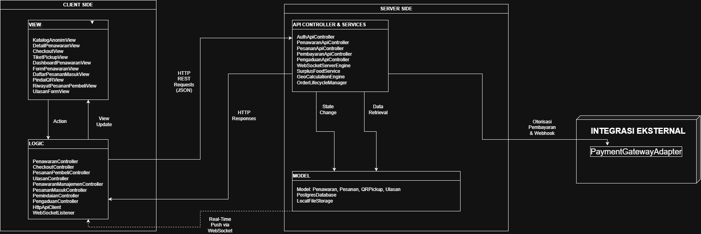
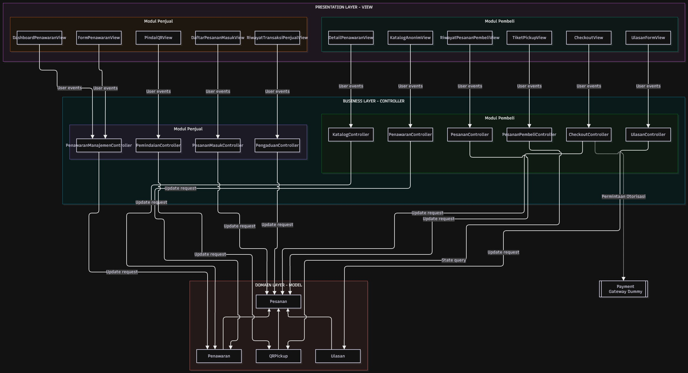
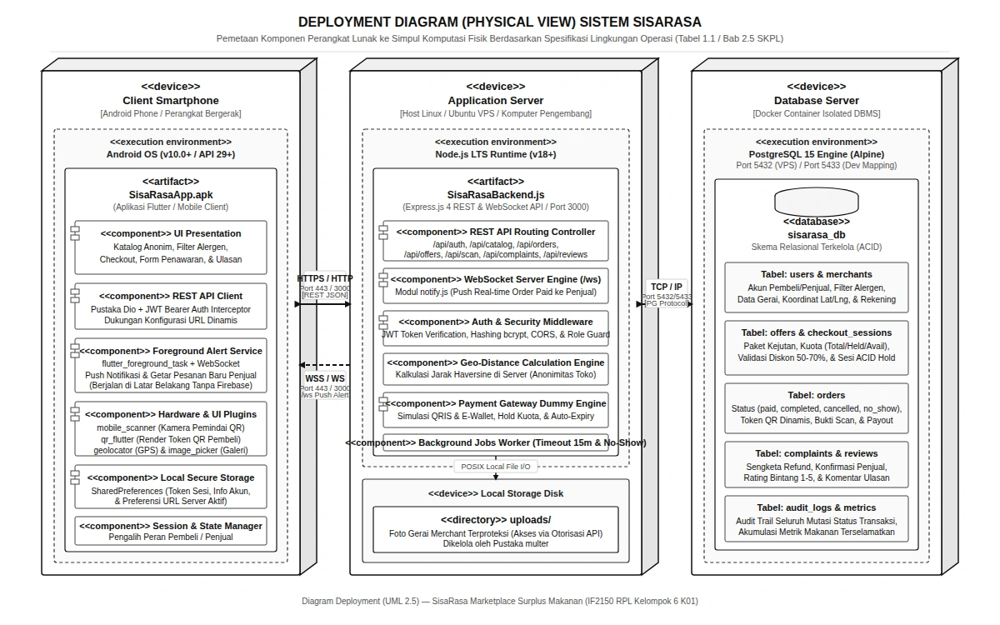

<h1>
IF2150 REKAYASA PERANGKAT LUNAK
 
TUGAS 6
 
ARSITEKTUR PERANGKAT LUNAK (APL)
</h1>
 

## _SisaRasa_

### Untuk: _Amanda Aurellia Salsabilla_

Dipersiapkan oleh:

| Informasi | Keterangan |
| --------- | ---------- |
| Kelas     | K1         |
| Kelompok  | 6          |

| NIM      | Nama                         |
| -------- | ---------------------------- |
| 13525067 | Fathar Atandra Denaya        |
| 13525040 | Muhammad Zaky Amani          |
| 13525139 | Josephine Bintang N.L        |
| 13525070 | Devina Athalia Putri Kusumah |
| 13525004 | Nabil Rabbani                |

---

 
 

# BAB 1: Style/Pattern Arsitektur Acuan

## 1.1 Architectural Pattern yang Dipilih dan Peran Bagiannya

Dalam perancangan arsitektur perangkat lunak SisaRasa, _architectural pattern_ utama yang dipilih adallah **Client-Server Architecture** yang dipadukan dengan **Layered Architecture (MVC)** di masing-masing sisi. Pola ini memisahkan secara tegas antarmuka pengguna pada perangkat seluler (_Client_) dengan pusat pengolahan data dan logika bisnis pada infrastruktur belakang (_Server_) melalui protokol komunikasi REST API (HTTP/HTTPS) dan WebSocket.

  

  <i>Gambar 1.1. Penerapan Arsitektur Client-Server pada Aplikasi SisaRasa</i>

Pembagian peran dan tanggung jawab tiap komponen dalam arsitektur ini meliputi:

1. **Client Side (Android Flutter Application):**
   - **View (UI Layer):** Bertanggung jawab menyajikan antarmuka bagi Pembeli (katalog anonim, _checkout_, filter alergen, tampilan QR _pickup_) dan Penjual (_dashboard_ pesanan, formulir penawaran, pemindai QR kamera).
   - **State Controller / Client Logic:** Mengelola keadaan lokal (_state_), menangani _user events_, menyimpan token autentikasi/QR secara _cached_, serta mempertahankan koneksi _WebSocket Background Service_ untuk menerima notifikasi pesanan masuk.

2. **Server Side (Node.js Express Backend):**
   - **API Controller Layer:** Menangani _endpoint_ REST API, memvalidasi _payload_ JSON masukan dari klien, serta mengelola lalu lintas koneksi WebSocket (`/ws`).
   - **Business Service Layer:** Mengeksekusi aturan bisnis inti (_business rules_), seperti validasi jendela terbit penawaran (maksimal 2 jam), perhitungan jarak relatif berbasis geolokasi di _server_, pembuatan token QR dinamis & _fallback_ OTP 6-digit, serta penanganan sengketa/pembatalan.
   - **Data Access / Repository Layer:** Berinteraksi langsung dengan basis data terpusat (PostgreSQL) dan penyimpanan berkas lokal server (`uploads/`) untuk operasi CRUD data entitas.

3. **Modul Eksternal / Subsistem Terintegrasi:**
   - **Dummy Payment Gateway Module:** Modul simulasi transaksi pembayaran digital (QRIS & _E-Wallet_) yang berjalan di dalam _server_ untuk mengelola penahanan kuota, waktu kedaluwarsa tagihan, dan pengiriman _webhook callback_.

---

## 1.2 Alasan Pemilihan Pattern

Pemilihan pola _Client-Server Architecture_ terintegrasi _Layered MVC_ didasarkan pada karakteristik fungsional (KF) dan non-fungsional (KNF) pada dokumen SKPL SisaRasa:

1. **Pemisahan Peran Pengguna Lintas Perangkat (Multi-User Role & Centralized State):**
   SisaRasa melibatkan dua aktor manusia (Pembeli `A01` dan Penjual `A02`) yang berada pada lokasi fisik terpisah. Pola _Client-Server_ memungkinkan seluruh keadaan transaksi, kuota paket surplus, dan penandatanganan status pesanan tersinkronisasi secara terpusat di server.
2. **Kebutuhan Komunikasi Real-Time (KF05 & KNF04):**
   Penjual membutuhkan notifikasi instan saat ada pembayaran lunas dari Pembeli tanpa perlu melakukan _refresh_ manual. Integrasi _Client-Server_ via saluran _WebSocket persistent_ yang dijaga _foreground service_ Android memastikan pesan notfikasi terkirim tepat waktu.
3. **Keamanan dan Kerahasiaan Data (KF06, KF08, & KNF05):**
   Sistem mewajibkan katalog disajikan secara anonim dan perhitungan jarak relatif dilakukan di server tanpa mengekspos koordinat GPS presisi _merchant_ sebelum pembayaran terverifikasi. Pola _Client-Server_ menjamin logika peka privasi ini dieksekusi secara aman di sisi server.
4. **Portabilitas & Kemudahan Pemeliharaan (KNF04):**
   Pengorganisasian kode secara _Layered MVC_ memudahkan pengembang untuk memperbarui antarmuka aplikasi Android atau mengubah modul internal (seperti _Payment Gateway dummy_) tanpa merusak struktur basis data inti.

---

## 1.3 Lingkungan Operasi Perangkat Lunak

Lingkungan operasi yang dibutuhkan agar aplikasi SisaRasa dapat berjalan dengan optimal ditunjukkan pada Tabel 1.1 berikut:

Tabel 1.1. Lingkungan Operasi Perangkat Lunak

| Komponen                  | Spesifikasi                                                                                                                                                                                 |
| :------------------------ | :------------------------------------------------------------------------------------------------------------------------------------------------------------------------------------------ |
| **Server aplikasi**       | Node.js 18 atau lebih baru dengan Express 4. API mendengarkan pada port 3000, termasuk jalur WebSocket `/ws` untuk pemberitahuan pesanan baru.                                              |
| **DBMS**                  | PostgreSQL 15. Pada pengembangan, basis data dijalankan dengan Docker dan dipetakan ke port 5433.                                                                                           |
| **Penyimpanan berkas**    | Foto gerai disimpan di direktori server (`uploads/`). Berkas hanya dapat diunduh lewat API setelah pengguna login dan identitas toko memang boleh dibuka.                                   |
| **Payment Gateway**       | Modul dummy di dalam server yang sama. Mendukung simulasi QRIS dan e-wallet, penahanan kuota, kedaluwarsa tagihan, serta konfirmasi pembayaran. Bukan QRIS bank sungguhan.                  |
| **Client**                | Aplikasi Android yang dibangun dengan Flutter. Dipasang sebagai berkas APK. Satu aplikasi memuat peran Pembeli dan Penjual.                                                                 |
| **OS klien**              | Android. Membutuhkan izin internet, lokasi (opsional, untuk urutan jarak), kamera (pemindaian QR Penjual), galeri (foto toko), dan notifikasi.                                              |
| **OS server**             | Linux pada VPS untuk operasi. Pengembangan dapat dilakukan di Linux, Windows, atau macOS selama Node.js, Docker, dan Flutter tersedia.                                                      |
| **Jaringan**              | HP dan server harus saling terjangkau. Contohnya Wi-Fi yang sama saat server masih di laptop, atau IP/domain VPS saat server dipindah. HTTPS dapat dipakai. HTTP tetap didukung untuk demo. |
| **Pemberitahuan Penjual** | Koneksi WebSocket yang dijaga oleh layanan latar depan Android. Tidak memakai Firebase. Selama layanan itu hidup, pesanan baru memunculkan notifikasi meski aplikasi tidak sedang dibuka.   |

### Kaitan Teknologi dengan Style/Pattern Arsitektur

Spesifikasi teknologi pada Tabel 1.1 mendukung penuh penerapan arsitektur _Client-Server_ dan _Layered MVC_:

- **Flutter (Dart) pada Sisi Klien:** Menyediakan arsitektur berbasis komponen UI (_Widget-View_) dan _State Management_ yang terpisah dari logika pemanggilan API, mewujudkan prinsip _Presentation Layer_.
- **Node.js Express 4 pada Sisi Server:** Mengadopsi struktur _routing/controller_ yang menangani permintaan HTTP REST API serta mengarahkan pemrosesan logika bisnis ke modul _services_ dan _repository_ basis data (PostgreSQL 15 via ORM/Driver).
- **Modul Native Android & WebSocket:** Koneksi WebSocket `/ws` dan _Foreground Service_ Android menghubungkan _Client_ dan _Server_ secara independen, memastikan peristiwa _real-time_ dapat diterima tanpa mengganggu pemrosesan data utama.

---

# BAB 2: Identifikasi Komponen / Modul / Subsistem

Pada bagian ini, lakukan identifikasi terhadap komponen, modul, atau subsistem yang menyusun aplikasi berdasarkan _pattern_ arsitektur yang telah ditetapkan sebelumnya. Setiap komponen memiliki tanggung jawab tertentu dalam mendukung fungsionalitas sistem.

Setiap komponen memiliki tanggung jawab tertentu dalam mendukung fungsionalitas sistem secara keseluruhan. Komponen dapat dikelompokkan berdasarkan lapisan arsitektur (misalnya _Model_, _View_, dan _Controller_ pada pattern MVC), atau berdasarkan fungsi atau peran komponen di dalam sistem (misalnya modul autentikasi, manajemen data, dan integrasi eksternal).

Tabel 2.1. Identifikasi Komponen Subsistem Modul Pembeli

| Nama Komponen/Modul/Subsistem | Jenis        | Penjelasan                                                                                                                                                                 |
| :---------------------------- | :----------- | :------------------------------------------------------------------------------------------------------------------------------------------------------------------------- |
| _Modul Pembeli_               | _Subsistem_  | _Mewadahi seluruh view, controller, dan lokal yang digunakan peran Pembeli di aplikasi._                                                                                   |
| _KatalogAnonimView_           | _View_       | _Menampilkan daftar penawaran paket surplus secara anonim beserta kontrol filter alergen dan pengurutan jarak (meneruskan aksi pencarian/filter ke PenawaranController)._  |
| _DetailPenawaranView_         | _View_       | _Menampilkan rincian satu penawaran (kategori, info alergen, harga normal/diskon, jendela pickup) sebelum Pembeli melanjutkan ke checkout._                                |
| _CheckoutView_                | _View_       | _Menampilkan ringkasan pesanan dan pilihan metode pembayaran (QRIS/E-Wallet), meneruskan konfirmasi ke CheckoutController._                                                |
| _KatalogController_           | _View_       | _Memproses permintaan daftar produk dan penambahan produk ke keranjang._                                                                                                   |
| _TiketPickupView_             | _View_       | _Menampilkan kode QR pickup beserta nama dan alamat merchant yang baru terbuka setelah pembayaran terverifikasi._                                                          |
| _RiwayatPesananPembeliView_   | _View_       | _Memproses pemilihan metode pembayaran dan meneruskan permintaan otorisasi ke PaymentGatewayAdapter._                                                                      |
| _PesananController_           | _Controller_ | _Menampilkan daftar pesanan milik Pembeli beserta status (menunggu bayar, menunggu pickup, selesai, gagal diambil) dan akses ke form ulasan._                              |
| _UlasanFormView_              | _View_       | _Menampilkan form rating bintang dan komentar untuk pesanan berstatus "Selesai"._                                                                                          |
| _PenawaranController_         | _Controller_ | _Memproses permintaan daftar penawaran dari KatalogAnonimView, meneruskan parameter filter alergen/lokasi ke HttpApiClient._                                               |
| _CheckoutController_          | _Controller_ | _Memproses pemilihan metode pembayaran dan mengirimkan permintaan checkout/otorisasi pembayaran ke server melalui HttpApiClient._                                          |
| _PesananPembeliController_    | _Controller_ | _Mengambil status dan detail pesanan Pembeli (termasuk token QR pickup) secara berkala dari server._                                                                       |
| _UlasanController_            | _Controller_ | _Memvalidasi input ulasan melalui ValidasiFormInput, lalu mengirimkan data rating/komentar ke server._                                                                     |
| _Penawaran_                   | _Model_      | _Representasi lokal data satu paket penawaran (kategori, harga, kuota, jendela pickup) yang diterima dari server, dipakai oleh KatalogAnonimView dan DetailPenawaranView._ |
| _Pesanan_                     | _Model_      | _Representasi lokal data satu pesanan beserta status alurnya, dipakai bersama oleh Modul Pembeli dan Modul Penjual._                                                       |
| _QRPickup_                    | _Model_      | _Representasi lokal token QR pickup dan masa berlakunya, ditampilkan oleh TiketPickupView._                                                                                |
| _Ulasan_                      | _Model_      | _Representasi lokal rating dan komentar yang akan dikirim lewat UlasanController._                                                                                         |

Tabel 2.2. Identifikasi Komponen Subsistem Modul Penjual

| Nama Komponen/Modul/Subsistem  | Jenis        | Penjelasan                                                                                                                                                       |
| :----------------------------- | :----------- | :--------------------------------------------------------------------------------------------------------------------------------------------------------------- |
| _Modul Penjual_                | _Subsistem_  | _Mewadahi seluruh view, controller, dan lokal yang digunakan peran Penjual di aplikasi._                                                                         |
| _DashboardPenawaranView_       | _View_       | _Menampilkan daftar penawaran aktif milik Penjual beserta sisa kuota, dan aksi edit/tutup penawaran._                                                            |
| _FormPenawaranView_            | _View_       | _Formulir untuk membuat atau mengubah penawaran (kategori, nilai normal, harga diskon, kuota, jendela pickup), dengan validasi lokal rentang diskon 50–70%._     |
| _DaftarPesananMasukView_       | _View_       | _Menampilkan pesanan yang sudah dibayar dan perlu disiapkan, lengkap jadwal pickup-nya._                                                                         |
| _PindaiQRView_                 | _View_       | _Antarmuka/Interface kamera untuk memindai kode QR pickup Pembeli sebagai bukti serah-terima._                                                                   |
| _RiwayatTransaksiPenjualView_  | _View_       | _Menampilkan riwayat transaksi milik Penjual._                                                                                                                   |
| _PenawaranManajemenController_ | _Controller_ | _Memproses pembuatan, perubahan, dan penutupan penawaran dari FormPenawaranView/DashboardPenawaranView, memanggil ValidasiFormInput sebelum mengirim ke server._ |
| _PesananMasukController_       | _Controller_ | _Mengambil daftar pesanan masuk dari server dan memperbarui tampilan DaftarPesananMasukView saat ada notifikasi baru dari WebSocketListener._                    |
| _PemindaianController_         | _Controller_ | _Menerima hasil pemindaian dari KameraScannerAdapter, lalu mengirimkan token QR ke server untuk divalidasi_                                                      |
| _PengaduanController_          | _Controller_ | _Memproses konfirmasi/penolakan Penjual atas pengajuan sengketa/refund dari Pembeli._                                                                            |

Tabel 2.3. Identifikasi Komponen Server Side & Integrasi

| Nama Komponen/Modul/Subsistem | Jenis                         | Penjelasan                                                                                                                                   |
| :---------------------------- | :---------------------------- | :------------------------------------------------------------------------------------------------------------------------------------------- |
| _Modul Server Side_           | _Subsistem_                   | _Mewadahi seluruh routing, controller, dan integrasi yang memproses logika bisnis di sisi server Node.js._                                   |
| _Router API_                  | _Routing_                     | _Mengelola dan mengarahkan jalur permintaan HTTP (REST API) dari aplikasi Android klien ke Controller yang sesuai._                          |
| _PenawaranController_         | _Controller (Server)_         | _Mengeksekusi logika bisnis untuk menerbitkan, mengubah, menutup, dan memfilter penawaran makanan surplus dari sisi server._                 |
| _PesananController_           | _Controller (Server)_         | _Menangani pembuatan pesanan, verifikasi pemindaian token kode QR pickup, serta memperbarui status transaksi di basis data._                 |
| _PembayaranController_        | _Controller (Server)_         | _Memproses permintaan checkout dari klien dan meneruskannya ke PaymentGatewaySimulator._                                                     |
| _WebSocket Engine_            | _Integrasi / Komunikasi_      | _Mengelola saluran komunikasi persisten dua arah (`/ws`) untuk menyiarkan notifikasi pesanan baru secara real-time ke perangkat Penjual._    |
| _HaversineGeoService_         | _Pendukung (Service)_         | _Menghitung perkiraan jarak spasial antara Pembeli dan Penjual sepenuhnya di sisi server untuk melindungi privasi koordinat merchant._       |
| _PaymentGatewaySimulator_     | _Integrasi Eksternal (Dummy)_ | _Subsistem internal yang mensimulasikan otorisasi pembayaran (QRIS/E-Wallet), menahan kuota sementara, dan membatalkan tagihan kedaluwarsa._ |
| _FileStorageService_          | _Penyimpanan Berkas_          | _Mengelola otorisasi akses dan penyimpanan fisik foto gerai pada direktori lokal `uploads/` di server._                                      |
| _Database (PostgreSQL)_       | _Penyimpanan Data_            | _Menjalankan transaksi ACID untuk menyimpan data pengguna, penawaran, pesanan, dan log audit secara persisten._                              |

---

# BAB 3: Model Arsitektur Perangkat Lunak

## 3.1 Logical View

### 3.1.1 Deksripsi Logical View

Logical View mendeskripsikan abstraksi utama sistem dan hubungannya untuk mendukung kebutuhan fungsional perangkat lunak. Fokus utama dari view ini adalah memetakan layanan dan fitur yang disediakan sistem agar pembagian fungsi dan hubungan layanan yang memenuhi kebutuhan bisnis SisaRasa dapat lebih mudah dipahami.

Logical View ini menstrukturkan komponen-komponen sistem ke dalam pola Model-View-Controller (MVC). Pola MVC secara tegas memisahkan pengelolaan data dan perilaku domain pada lapisan Model, penyajian informasi pada lapisan View, serta koordinasi interaksi pengguna pada lapisan Controller. Pembagian ini menjamin modularitas tinggi antara Modul Pembeli dan Modul Penjual, meskipun keduanya berinteraksi dengan entitas domain sentral yang sama.

<i>Gambar 2. Diagram Logical View SisaRasa</i>

### 3.1.2 Relasi dan Interaksi Antarkomponen

Diagram keseluruhan sistem di atas mendeskripsikan abstraksi relasi fungsional. Hubungan antarkomponen diatur berdasarkan prinsip arsitektur MVC:

1. View --> Controller (User Events): Komponen View bertanggung jawab menyajikan antarmuka dan menangkap interaksi pengguna (seperti menekan tombol checkout atau menyimpan penawaran). Interaksi ini diteruskan ke Controller dalam bentuk User events.
2. Controller --> Model (Update Request): Controller memetakan aksi pengguna menjadi pembaruan pada entitas data. Controller mengirimkan Update request ke komponen Model untuk mengubah status, memotong kuota, atau memvalidasi logika bisnis.
3. Model --> Model (Agregasi & Komposisi): Entitas data pada Model saling berelasi. Pesanan memiliki relasi agregasi dengan Penawaran (karena penawaran tetap ada meskipun pesanan dibatalkan). Sebaliknya, Pesanan memiliki relasi komposisi dengan QRPickup dan Ulasan (karena QR dan Ulasan tidak dapat berdiri sendiri tanpa adanya pesanan).
4. Controller --> Eksternal: CheckoutController mendelegasikan proses penahanan kuota dan pemrosesan dana ke sistem eksternal Payment Gateway Dummy melalui koneksi terpisah.

### 3.1.3 Audit Konsistensi Arsitektur Logis

Audit ini memastikan bahwa rancangan _Logical View_ telah mencakup seluruh komponen, kelas, dan subsistem yang diidentifikasi pada Bab 2, serta mendukung seluruh _use case_ yang ditetapkan pada SKPL.

| Aspek Arsitektur                  | Kriteria Acuan (Bab 1, Bab 2 & SKPL)                                       | Implementasi pada Logical View                                                                         | Status Evaluasi |
| :-------------------------------- | :------------------------------------------------------------------------- | :----------------------------------------------------------------------------------------------------- | :-------------: |
| **Kepatuhan Pola (Pattern)**      | Memisahkan data, penyajian, dan koordinasi interaksi pada pola MVC.        | Diagram dikelompokkan secara hierarkis menjadi tiga lapisan utama: _View_, _Controller_, dan _Model_.  |    **Valid**    |
| **Kelengkapan Subsistem Pembeli** | Mencakup seluruh kelas _View_ dan _Controller_ Modul Pembeli (Tabel 2.1).  | `KatalogAnonimView`, `CheckoutView`, `KatalogController`, dll., seluruhnya terpetakan di zona Pembeli. |    **Valid**    |
| **Kelengkapan Subsistem Penjual** | Mencakup seluruh kelas _View_ dan _Controller_ Modul Penjual (Tabel 2.2).  | `FormPenawaranView`, `PindaiQRView`, `PesananMasukController`, dll., terpetakan di zona Penjual.       |    **Valid**    |
| **Sentralisasi Domain (Model)**   | Berisi entitas data: `Penawaran`, `Pesanan`, `QRPickup`, `Ulasan` (Bab 2). | Dikelompokkan pada _Domain Layer_ yang diakses oleh _Controller_ dari kedua aktor (Pembeli & Penjual). |    **Valid**    |
| **Dukungan Kebutuhan Eksternal**  | Mendukung integrasi dengan _Payment Gateway dummy_ sesuai alur bisnis.     | `CheckoutController` memiliki relasi _Permintaan Otorisasi_ terhadap modul `Payment Gateway Dummy`.    |    **Valid**    |

## 3.2 Deployment View (Physical View) & Audit Konsistensi

### 3.2.1 Deskripsi Deployment View

Deployment View (Physical View) menggambarkan pemetaan fisik antara modul dan artefak perangkat lunak SisaRasa ke dalam simpul komputasi (_nodes_), lingkungan eksekusi (_runtime_), serta media komunikasi fisik yang menghubungkannya. Seluruh pemetaan pada _view_ ini diturunkan secara langsung dari spesifikasi lingkungan operasi pada Tabel 1.1 dokumen ini (serta subbab 2.5 dokumen SKPL).

  

  <i>Gambar 3. Deployment Diagram (Physical View) Sistem SisaRasa</i>

Sistem SisaRasa terdistribusi ke dalam 3 simpul fisik (_tier_) utama:

1. **Client Node (Smartphone Android Pengguna):**
   - **Simpul Fisik**: Perangkat bergerak (_smartphone_) pengguna yang menjalankan sistem operasi Android (minimal Android 10 / API level 29 ke atas).
   - **Artefak Perangkat Lunak**: Berkas biner tunggal `SisaRasaApp.apk` yang dibangun menggunakan framework Flutter. Berkas aplikasi ini memuat peran Pembeli dan Penjual sekaligus yang dapat diakses sesuai kredensial saat autentikasi.
   - **Subsistem & Modul Internal**:
     - _Modul Pembeli_: Penelusuran katalog makanan surplus secara anonim, pengaturan preferensi filter alergen, formulir checkout, penampil tiket penjemputan (kode QR dinamis), serta antarmuka pemberian ulasan/rating.
     - _Modul Penjual_: Manajemen formulir penawaran (validasi diskon 50–70% dan kelayakan konsumsi), pemantau jadwal penjemputan, serta antarmuka pemindai kode QR penjemputan.
     - _Layanan Native & Jaringan_: Pustaka kamera `mobile_scanner` untuk validasi serah-terima fisik, plugin geolokasi perangkat (`geolocator`) untuk penghitungan jarak, modul HTTP REST client berbasis JSON (`dio`) dengan penyisipan _Bearer JWT Token_, serta _Android Foreground Service_ (`flutter_foreground_task`) yang menjaga koneksi WebSocket tetap hidup di latar belakang agar notifikasi pesanan baru dapat diterima oleh Penjual secara seketika.
2. **Application Server Node (Host Server Aplikasi):**
   - **Simpul Fisik**: Server komputasi fisik atau Virtual Private Server (VPS) berbasis sistem operasi Linux (Ubuntu LTS). Pada fase pengembangan lokal, simpul ini dapat berjalan langsung di komputer pengembang.
   - **Lingkungan Eksekusi**: Runtime Node.js LTS (versi 18 ke atas) yang menjalankan aplikasi web server berbasis Express.js 4 pada port 3000.
   - **Subsistem & Modul Internal**:
     - _Router & Controller API_: Mengelola jalur permintaan REST API (`/api/auth`, `/api/catalog`, `/api/orders`, `/api/scan`, `/api/complaints`, dll.).
     - _WebSocket Server Engine_: Mengelola saluran komunikasi persisten `/ws` untuk menyiarkan pemberitahuan pesanan masuk baru ke HP Penjual secara _real-time_.
     - _Geo-Calculation Engine_: Menghitung perkiraan jarak relatif antara pembeli dan merchant di sisi server menggunakan formula Haversine tanpa mengekspos koordinat GPS presisi toko sebelum pembayaran.
     - _In-Server Payment Gateway Simulator_: Modul dummy terintegrasi di dalam server untuk memproses simulasi pembayaran digital (QRIS dan e-wallet), penahanan kuota, serta pembatalan tagihan kedaluwarsa.
     - _Background Job Worker_: Proses latar belakang terjadwal untuk membatalkan sesi checkout yang melewati batas waktu 15 menit, menonaktifkan kode QR yang kedaluwarsa, dan menjadwalkan pencairan dana (_payout_).
     - _Penyimpanan Berkas Terproteksi_: Direktori disk lokal server (`uploads/`) untuk menyimpan foto gerai toko yang hanya dapat diakses melalui otorisasi API setelah transaksi berhasil.
3. **Database Server Node (Simpul Persistensi Data):**
   - **Simpul Fisik / Kontainer**: Kontainer terisolasi Docker yang menjalankan sistem manajemen basis data relasional PostgreSQL 15.
   - **Basis Data Relasional (`sisarasa_db`)**: Mengelola tabel persisten sistem, meliputi `users`, `merchants`, `offers`, `orders`, `checkout_sessions` (pengendali isolasi ACID kuota), `complaints` (pengaduan refund), `reviews` (ulasan pembeli), serta `audit_logs` dan `platform_metrics`.

### 3.2.2 Protokol Jaringan dan Komunikasi Antar-Simpul

Interaksi antar-simpul fisik diatur dengan ketentuan protokol sebagai berikut:

1. **Client Node ↔ Application Server Node (REST API)**:
   - Menggunakan protokol **HTTPS / HTTP** pada port 443 / 3000 dengan format muatan data pertukaran terstandarisasi **JSON**.
   - Seluruh permintaan yang memerlukan hak akses dilindungi oleh _Authorization Header_ berbasis JSON Web Token (JWT).
2. **Client Node ↔ Application Server Node (Notifikasi Real-time)**:
   - Menggunakan protokol **WebSocket (WSS / WS)** pada port 443 / 3000 melalui endpoint `/ws`.
   - Saluran ini beroperasi secara _full-duplex_ dan dipertahankan oleh layanan latar depan Android (_Android Foreground Service_) sehingga penjual langsung memperoleh getaran/notifikasi saat ada pesanan masuk meskipun aplikasi tidak sedang aktif dibuka di layar utama.
3. **Application Server Node ↔ Database Server Node**:
   - Menggunakan protokol biner bawaan basis data (**PostgreSQL Wire Protocol**) melalui jaringan TCP/IP internal pada port 5432 (atau port 5433 pada pemetaan Docker lokal pengembang) dengan mekanisme _connection pooling_ (`pg.Pool`).
4. **Application Server Node ↔ Storage Disk**:
   - Menggunakan panggilan antarmuka I/O berkas lokal sistem operasi (_POSIX Local File System API_) untuk operasi baca/tulis berkas foto gerai.

### 3.2.3 Audit Konsistensi Arsitektur Fisik

Bagian audit ini mengevaluasi keselarasan antara perancangan Deployment View terhadap spesifikasi Lingkungan Operasi pada Tabel 1.1 dokumen APL (serta subbab 2.5 dokumen SKPL) dan pemenuhan Kebutuhan Non-Fungsional (KNF):

| Komponen / Kebutuhan         | Spesifikasi Acuan (Tabel 1.1 / SKPL)                           | Implementasi Fisik pada Deployment View                                                                     |      Status Evaluasi       |
| :--------------------------- | :------------------------------------------------------------- | :---------------------------------------------------------------------------------------------------------- | :------------------------: |
| **Klien Mobile**             | Aplikasi Android dibangun dengan Flutter (berkas APK)          | Simpul `Client Smartphone` memuat artefak `SisaRasaApp.apk` (gabungan peran Pembeli & Penjual)              | **Valid (100% Konsisten)** |
| **Server Aplikasi**          | Node.js 18+ dengan Express 4 (Port 3000, rute WebSocket `/ws`) | Simpul `Application Server` menjalankan runtime Node.js dan Express 4 API + WebSocket Engine pada port 3000 | **Valid (100% Konsisten)** |
| **DBMS**                     | PostgreSQL 15 via Docker (port 5433 dev / 5432 VPS)            | Simpul `Database Server` menjalankan kontainer Docker PostgreSQL 15 (`sisarasa_db`)                         | **Valid (100% Konsisten)** |
| **Penyimpanan Berkas**       | Foto gerai disimpan di direktori `uploads/` server terproteksi | Direktori lokal `uploads/` pada disk simpul Application Server dengan gerbang otorisasi API                 | **Valid (100% Konsisten)** |
| **Payment Gateway**          | Modul simulasi dummy in-server (QRIS & e-wallet)               | Subkomponen simulator terintegrasi di dalam simpul `Application Server`                                     | **Valid (100% Konsisten)** |
| **Pemberitahuan Penjual**    | WebSocket via layanan latar depan Android (tanpa Firebase)     | Jalur protokol WSS/WS terdedikasi antara HP Penjual dan `/ws` pada server aplikasi                          | **Valid (100% Konsisten)** |
| **KNF01 (Keandalan ACID)**   | Transaksi pembayaran & kuota memenuhi prinsip ACID             | Ditangani oleh transaksi terisolasi PostgreSQL 15 (`checkout_sessions` & kuota `offers`)                    |       **Terpenuhi**        |
| **KNF02 (Keamanan Data)**    | Enkripsi data & perlindungan identitas                         | Jalur komunikasi HTTPS/TLS, otorisasi token JWT, dan koordinat GPS presisi toko tidak terekspos             |       **Terpenuhi**        |
| **KNF03 (Notifikasi Cepat)** | Pemberitahuan pesanan masuk seketika                           | Mekanisme _event push_ WebSocket seketika ke HP Penjual begitu status pembayaran berhasil                   |       **Terpenuhi**        |
| **KNF04 (Efisiensi Biaya)**  | Biaya pihak ketiga Rp 0 (Self-hosted open-source)              | Seluruh stack berjalan mandiri di VPS/lokal tanpa layanan berbayar pihak ketiga                             |       **Terpenuhi**        |

---

# Referensi

- Sommerville, I. (2016). _Software Engineering_ (10th ed.). Pearson. Chapter 6: _Architectural Design_: [https://software-engineering-book.com/slides/](https://software-engineering-book.com/slides/)
- Diagram arsitektur: [https://www.drawio.com/](https://www.drawio.com/), [https://staruml.io/](https://staruml.io/)
