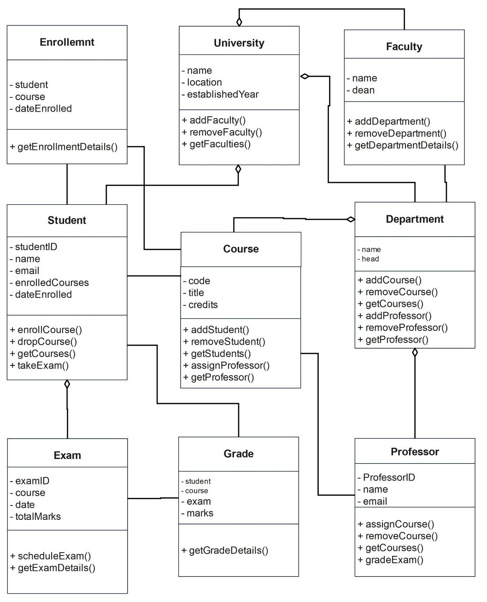

<h1>
IF2150 REKAYASA PERANGKAT LUNAK
 
TUGAS 5
 
DESKRIPSI PERANCANGAN PERANGKAT LUNAK (DPPL)
</h1>
 

## *Nama Perangkat Lunak*
### *[Logo Perangkat Lunak]*

### Untuk: *[Nama Asisten]*

Dipersiapkan oleh:
| Informasi | Keterangan |
| --- | --- |
| Kelas | *\[Kelas\]* |
| Kelompok | *\[Nomor Kelompok\]*  |

| NIM | Nama |
|---|---|
| *[NIM 1]* | *[Nama Anggota 1]* |
| *[NIM 2]* | *[Nama Anggota 2]* |
| *[NIM 3]* | *[Nama Anggota 3]* |
| *[NIM 4]* | *[Nama Anggota 4]* |
| *[NIM 5]* | *[Nama Anggota 5]* |
---

## Daftar Perubahan

| Revisi | Deskripsi |
| :--- | :--- |
| *A* | *Deskripsikan perubahan yang dilakukan dari dokumen sebelumnya pada dokumen ini. Jika tidak terdapat perubahan, harap kosongkan tabel.* |
| *B* |  |
| *C* |  |
| ... |  |

---

 

> **Petunjuk pengerjaan:** *[Silahkan hapus bagian ini setelah selesai mengerjakan]*
>
> Dokumen ini melanjutkan **Spesifikasi Kebutuhan Perangkat Lunak (SKPL)** dan **Arsitektur Perangkat Lunak (APL)**. Gunakan nama, ID, kebutuhan, dan use case yang konsisten dengan kedua dokumen tersebut. Contoh pola ID baru di bawah dapat disesuaikan dengan kesepakatan kelompok, ID yang sudah ada tetap dipertahankan.

 

---

# BAB 1: Pendahuluan

## 1.1 Tujuan Penulisan Dokumen
Tuliskan dengan ringkas tujuan dokumen DPPL ini dibuat dan siapa saja yang akan menggunakan dokumen ini.

## 1.2 Lingkup Masalah
Tuliskan dengan ringkas nama aplikasi dan deskripsi singkatnya. Bagian ini maksimal berisi satu paragraf, dapat diambil dari SKPL.

## 1.3 Definisi, Istilah, dan Singkatan
Semua definisi dan singkatan yang digunakan dalam dokumen ini beserta penjelasannya.

Tabel 1.3. Definisi Istilah dan Singkatan

| Singkatan, Akronim, atau Istilah | Penjelasan |
| :--- | :--- |
| *P/L* | *Singkatan dari Perangkat Lunak, yaitu aplikasi yang memberikan perintah kepada komputer untuk menjalankan tugas tertentu.* |
| *DPPL* | *Singkatan dari Spesifikasi Kebutuhan Perangkat Lunak, yaitu dokumen yang merangkum kriteria-kriteria yang diperlukan untuk membangun aplikasi menjalankan tugasnya.* |
| *UC* | *Singkatan dari Use Case.* |
| *...* | *...* |

## 1.4 Aturan Penomoran
Tuliskan aturan penomoran (ID) yang digunakan dalam dokumen ini. Gunakan pola ID yang **sama** dengan yang sudah dipakai pada dokumen-dokumen sebelumnya, jangan membuat pola baru di dokumen ini.

Tabel 1.4. Aturan Penomoran

| Hal/Bagian | Penomoran | Keterangan |
| :--- | :--- | :--- |
| *Uce Case* | *UCXX* | |
| *Kelas* | *CXX* | |
| *...* | *...* |

## 1.5 Referensi
Cantumkan dokumentasi P/L yang dirujuk oleh dokumen ini, **minimal dokumen SKPL dan APL**. Tambahkan buku, panduan, atau dokumentasi lain apabila digunakan.

## 1.6 Deskripsi Umum Dokumen (Ikhtisar)
Tuliskan sistematika pembahasan dokumen ini secara ringkas dan runut, dengan maksimal 1 paragraf.

 

---

# BAB 2: Perancangan Arsitektur

## 2.1 Rancangan Lingkungan Implementasi

Sebutkan *operating system*, DBMS, *development tools*, *filing system*, dan bahasa pemrograman yang digunakan.

## 2.2 Style/Pattern Arsitektur Acuan

Tentukan *architectural style* atau *pattern* yang menjadi acuan aplikasi, misalnya *layered architecture*, *client-server*, *repository*, *pipe and filter*, atau MVC (*Model-View-Controller*).

Gunakan hasil **BAB 1 Style/Pattern Arsitektur Acuan pada dokumen APL**, termasuk alasan pemilihan dan gambar penerapannya pada P/L kelompok. Gunakan komponen aplikasi sendiri pada gambar, bukan hanya contoh pola umum.

<i>Gambar 1. Contoh Arsitektur MVC</i>

## 2.3 Identifikasi Komponen / Modul / Subsistem

Identifikasi komponen, modul, atau subsistem penyusun aplikasi berdasarkan *pattern* yang telah ditetapkan. Jelaskan tanggung jawab masing-masing komponen. Pengelompokan dapat mengikuti lapisan arsitektur atau fungsi/peran komponen dalam sistem.

Ambil dari **Tabel 2.1 dokumen APL**, lalu kelompokkan berdasarkan lapisan (Model/View/Controller). Kolom **Jenis** diisi sesuai pattern, misalnya View, Controller, Model, Service, Repository. Satu komponen merepresentasikan saatu tanggung jawab utama yang jelas,

Tabel 2.3. Identifikasi Komponen/Modul/Subsistem

| Nama Komponen/Modul/Subsistem | Jenis | Penjelasan |
| :--- | :--- | :--- |
| *[Nama komponen/modul/subsistem]* | *[Jenis]* | *[Tanggung jawab komponen]* |
| *[Nama komponen/modul/subsistem]* | *[Jenis]* | *[Tanggung jawab komponen]* |
| *...* | *...* | *...* |

## 2.4 Model Arsitektur Perangkat Lunak

Buat model arsitektur dalam bentuk satu atau lebih *view* yang memperlihatkan interaksi dan kolaborasi komponen, modul, serta subsistem dalam menjalankan fungsi sistem. Pilih notasi yang sesuai. Contoh *view*: *Logical View*, *Process View*, *Development View*, dan *Physical View*.

Gunakan hasil **BAB 3 Model Arsitektur Perangkat Lunak pada dokumen APL**. 

### 2.4.1 View [Nama View]

Tuliskan secara singkat model arsitektur yang dipilih dan alasan model tersebut cocok untuk aplikasi.

<i>Gambar 2. Contoh Logical View pada P/L E-Commerce</i>

### 2.4.X View [Nama View]
*[Lakukan hal yang sama dengan bagian sebelumnya]*

 

---

# BAB 3: Realisasi Use Case

## 3.1 Use Case [Nama Use Case 1]

**ID Use Case:** *[UC01 sesuai SKPL]*  
**Nama Use Case:** *[Nama use case sesuai SKPL]*

### 3.1.1 Identifikasi Kelas

Identifikasi kelas yang terkait dengan use case tersebut. Kelas di tahap perancangan dapat berbeda dengan dengan kelas di tahap analisis. Dapat menggunakan tabel di bawah:

Tabel 3.1. Identifikasi Kelas Use Case [UC01]

| No | Nama Kelas Perancangan | Nama Kelas Analisis Terkait |
|:--- | :--- | :--- |
| 1 | *[Nama kelas perancangan]* | *[Nama kelas analisis pada SKPL]* |
| 2 | *[Nama kelas perancangan]* | *[Nama kelas analisis pada SKPL]* |
| ... | *...* | *...* |

### 3.1.2 Sequence Diagram

Buat *sequence diagram* untuk **setiap skenario use case**, mencakup skenario normal dan alternatif pada subbab 4.4 SKPL. Diagram melibatkan kelas-kelas yang telah diidentifikasi pada SKPL. 

- **Skenario Normal**

<i>Gambar X. Sequence Diagram [UC01]</i>

- **Skenario Alternatif [Nomor]: [Nama Skenario]**

<i>Gambar X. Sequence Diagram [UC01] - [Nama skenario alternatif]</i>

### 3.1.3 Diagram Kelas

Buatlah diagram kelas untuk use case ini yang terdiri atas kelas-kelas dari 3.1.1. **Setiap kelas pada diagram wajib menampilkan atribut dan metode/operasi langsung di dalam kotak kelasnya**, sehingga tidak perlu membuat tabel daftar atribut dan metode per kelas pada subbab ini. Daftar lengkap atribut dan metode seluruh kelas disajikan pada Tabel 4.1 (Bab 4).

<i>Gambar X. Diagram Kelas [Nama Uce Case]</i>

Pada diagram, pastikan:
- Atribut dituliskan beserta visibilitas dan tipe datanya, misalnya `- email: String`.
- Operasi dituliskan beserta visibilitas, parameter, dan tipe kembaliannya, misalnya `+ login(email: String, password: String): Boolean`.
- Relasi antarkelas (asosiasi, agregasi, komposisi, generalisasi, dan dependensi) digambarkan lengkap dengan multiplisitas.
- Semua operasi yang dipanggil pada sequence diagram 3.1.2 (skenario normal dan alternatif) ada pada kelas yang bersangkutan.
- Kelas yang sama dengan kelas di use case lain memakai nama, atribut, dan metode yang konsisten.

## 3.2 Use Case XX

Silahkan lanjutkan untuk  *use case* berikutnya dengan content yang sama dengan 3.1

 

---

# BAB 4: Diagram Kelas Keseluruhan

## 4.1 Diagram Kelas

**Bagian ini diisi dengan diagram kelas keseluruhan.**

<i>Gambar 4.1. Diagram Kelas Perancangan Keseluruhan [Nama P/L]</i>

Tabel 4.1. Daftar Kelas Perancangan Keseluruhan

| ID Kelas | Nama Kelas | Atribut | Metode/Operasi |
| :--- | :--- | :--- | :--- |
| *[C01]* | *[Nama kelas]* | *[Daftar atribut]* | *[Daftar metode/operasi]* |
| *[C02]* | *[Nama kelas]* | *[Daftar atribut]* | *[Daftar metode/operasi]* |
| *[C03]* | *[Nama kelas]* | *[Daftar atribut]* | *[Daftar metode/operasi]* |
| *...* | *...* | *...* | *...* |

 

---

# BAB 5: Matriks Kerunutan

Petakan kelas perancangan dengan use case yang terkait. Gunakan **BAB 6 Traceability pada dokumen SKPL** sebagai acuan keterkaitan kelas analisis dan use case, lalu sesuaikan dengan realisasi use case dan kelas perancangan pada BAB 3–BAB 5 DPPL.

Tabel 7.1. Matriks Kerunutan Kelas terhadap Use Case

| Kelas | Use Case Terkait |
| :--- | :--- |
| *[ID kelas - Nama kelas]* | *[ID UC - Nama use case]* |
| *[ID kelas - Nama kelas]* | *[ID UC - Nama use case]* |
| *...* | *...* |
